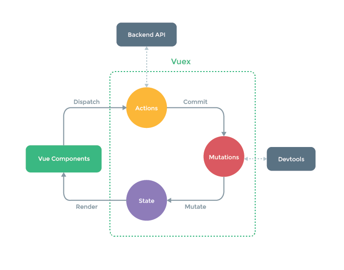

# Chapter 6 使用 vuex实现状态管理

### Vuex 是什么

Vuex 是一个专为 Vue.js 应用程序开发的**状态管理模式**。它采用集中式存储管理应用的所有组件的状态，并以相应的规则保证状态以一种可预测的方式发生变化

当我们遇到多个组件共享状态时，单项数据流的简洁性很容易被破坏

- 多个视图依赖同一状态
- 来自不同的视图行为需要变更同一状态

Vuex 做到了将组件共享的状态抽取出来，以一个全局单例的模式来管理这些状态



如果开发一个简单的应用，那么 Vuex 并不是很好的选择。但是，如果您需要构建一个中大型单页应用，您很可能会考虑如何更好地在组件外部管理状态，Vuex 将会成为自然而然的选择

### 开始

每一个 Vuex 引用的核心就是 store（仓库）。store 基本上就是一个容器，它包含着应用中大部分的状态。Vuex 和单纯的全局对象有以下不同

1. Vuex 的状态存储是响应式的，可以很好的与 Vue 的响应式结合
2. 不能直接的改变 store 中的状态，改变 store 中状态的唯一途径就是通过显示的提交 mutation ，这样使得我们可以方便地跟踪每一个状态的变化

# 核心概念

## State

Vuex 使用 单一状态树，用一个对象包含了全部的应用层级状态。作为一个唯一数据源存在

存储在 Vuex 中的数据和 Vue实例中的 data 遵循相同的规则

### 在 Vue 组件中获得 Vuex 状态

由于 Vuex 的状态存储是响应式的，从 store 实例中读取状态最简单的方法就是在计算属性中返回某个状态

Vuex 通过 `store` 选项，提供了一种机制将状态从根组件“注入”到每一个子组件中（需调用 `Vue.use(Vuex)`）

通过在根实例中注册 `store` 选项，该 store 实例会注入到根组件下的所有子组件中，且子组件能通过 `this.$store` 访问到

```JavaScript
const app = new Vue({
  el: '#app',
  // 把 store 对象提供给 "store" 选项，这可以把 store 的实例注入所有的子组件
  store,
  components: { Counter },
  template: `
    <div class="app">
      <counter></counter>
    </div>
  `
})
```

```JavaScript
const Counter = {
  template: `<div>{{ count }}</div>`,
  computed: {
    count () {
      return this.$store.state.count
    }
  }
}
```

### mapState 辅助函数

当一个组件需要获取多个状态的时候，将这些状态都声明为计算属性会有些重复和冗余。为了解决这个问题，我们可以使用 `mapState` 辅助函数帮助我们生成计算属性

```JavaScript
// 在单独构建的版本中辅助函数为 Vuex.mapState
import { mapState } from 'vuex'

export default {
  // ...
  computed: mapState({
    // 箭头函数可使代码更简练
    count: state => state.count,

    // 传字符串参数 'count' 等同于 `state => state.count`
    countAlias: 'count',

    // 为了能够使用 `this` 获取局部状态，必须使用常规函数
    countPlusLocalState (state) {
      return state.count + this.localCount
    }
  })
}
```

当映射的计算属性与 state 子节点名称相同时，可以直接给 mapState 传一个字符串

```JavaScript
computed: mapState([
  // 映射 this.count 为 store.state.count
  'count'
])
```

如果需要同局部计算属性混合使用，则需要用到对象展开运算符，将 mapState 返回的对象与 computed 对象的局部计算属性结合成一个新的对象，也就是将 mapState 对象的所有属性原样传递给 computed

## Getter

可以简单的理解为 store 的计算属性，其特点同计算属性也是类似的，会将getter的值缓存起来，当其依赖的值发生变化时才会被重新计算

Getter 接受 state 作为其第一个参数

### Getter的访问方式

可以通过属性访问，getter 会暴露为 store.getters 对象，可以以属性的方式访问这些值

Getter 也可以接受其他 getter 作为第二个参数

也可以通过让 getter 返回一个函数，来实现给 getter传参。getter 在通过方法访问时，每次都会去进行调用，而不会缓存结果

Vuex 也提供了 mapGetter 来讲 store 中的 getter 映射到局部计算属性

## Mutation

更改 Vues 的 store 中状态的唯一方法就是提交 mutation。Vuex 中的 mutation 非常类似于事件：每个 mutation 都有一个字符串的 **事件类型 (type)** 和 一个 **回调函数 (handler)**。这个回调函数就是我们实际进行状态更改的地方，并且它会接受 state 作为第一个参数

mutation handler 不可以直接调用，而是要以相应的 type 调用 **store.commit** 方法

```JavaScript
const store = new Vuex.Store({
  state: {
    count: 1
  },
  mutations: {
    increment (state) {
      // 变更状态
      state.count++
    }
  }
})

store.commit('increment')
```

可以向 store.commit 传入额外的参数，即 mutation 的 载荷（payload），作为 mutation 回调函数的第二个参数传入

```JavaScript
store.commit('increment', {
  amount: 10
})
```

提交 mutation 的另一种方式是直接使用包含 `type` 属性的对象

```JavaScript
store.commit({
  type: 'increment',
  amount: 10
})
```

### Mutation 需遵守 Vue 的响应规则

Vuex 中的 mutation 也需要与使用 Vue 一样遵守一些注意事项

- 最好提前在 store 中初始化好所有属性
- 如果需要在对象上添加新属性时，应该
   - 使用 Vue.set()
   - 或者以新对象替换老对象 `state.obj={…state.obj, newProp:123}`

### 使用常量替代 Mutation 事件类型

```JavaScript
// mutation-types.js
export const SOME_MUTATION = 'SOME_MUTATION'

// store.js
import Vuex from 'vuex'
import { SOME_MUTATION } from './mutation-types'

const store = new Vuex.Store({
  state: { ... },
  mutations: {
    // 我们可以使用 ES2015 风格的计算属性命名功能来使用一个常量作为函数名
    [SOME_MUTATION] (state) {
      // mutate state
    }
  }
})
```

### Mutation 必须是同步函数

一条重要的原则就是要记住 **mutation 必须是同步函数**

### 在组件中提交 Mutation

在组件中可以使用 `this.$store.commit(‘’)` 来提交 mutation，或者使用 `mapMutation` 辅助函数将组件中的methods 映射为 store.commit调用

### Action

action类似于 mutation，不同点在于：

- action 提交的是mutation，而不是直接改变状态
- action可以包含任意异步操作

Action 函数接受一个与 store 实例具有相同方法和属性的 context 对象，因此你可以调用 `context.commit` 提交一个 mutation，或者通过 `context.state` 和 `context.getters` 来获取 state 和 getters。

实践中，我们会经常用到 ES2015 的 [参数解构 (opens new window)](https://github.com/lukehoban/es6features#destructuring)来简化代码（特别是我们需要调用 `commit` 很多次的时候）：

```JavaScript
actions: {
	increment (context) {
   		context.commit('increment')
 	}
}

actions: {
  increment ({ commit }) {
    commit('increment')
  }
}
```

### 分发 Action

Action 通过 `store.dispatch` 方法触发

Action 就不受约束！我们可以在 action 内部执行**异步**操作

Actions 支持同样的载荷方式和对象方式进行分发，传参方式同mutation相同

### 在组件中分发Action

组件中可以使用 `this.$store.dispatch(‘’)` 来分发 action，或者使用 mapAction 辅助函数将组件的 methods 映射为 `store.dispatch` 调用

### 组合Action

Action 通常是异步的，如果需要知道action何时执行结束，`store.dispatch` 可以处理被触发的 action 的处理函数返回的 Promise，并且 `store.dispatch` 仍旧返回 Promise

```JavaScript
actions: {
  actionA ({ commit }) {
    return new Promise((resolve, reject) => {
      setTimeout(() => {
        commit('someMutation')
        resolve()
      }, 1000)
    })
  }
}


store.dispatch('actionA').then(() => {
  // ...
})
```

如果使用 async/await，那么可以

```JavaScript
// 假设 getData() 和 getHTMLData() 返回的是 Promise

actions: {
  async actionA ({ commit }) {
    commit('gotData', await getData())
  },
  async actionB ({ dispatch, commit }) {
    await dispatch('actionA') // 等待 actionA 完成
    commit('gotHTMLData', await getHTMLData())
  }
}
```

## Module

由于使用单一状态树，当应用变得非常复杂时，store 对象就有可能变得相当臃肿

为了解决以上问题，Vuex 允许我们将 store 分割成模块（module）。每个模块都有自己的 state，mutation, action, getter，甚至是嵌套子模块

### 模块局部状态

对于模块内部的 mutation 和 getter，接收的第一个参数是**模块的局部状态对象**。

同样，对于模块内部的 action，局部状态通过 `context.state` 暴露出来，根节点状态则为 `context.rootState`

对于模块内部的 getter，根节点状态会作为第三个参数暴露出来

### 命名空间

默认情况下，模块内部的 action、mutation 和 getter 是注册在**全局命名空间**的——这样使得多个模块能够对同一 mutation 或 action 作出响应

可以通过添加 `namespaced: true` 的方式使其成为带命名空间的模块。当模块被注册后，它的所有 getter、action 及 mutation 都会自动根据模块注册的路径调整命名

```JavaScript
const store = new Vuex.Store({
  modules: {
    account: {
      namespaced: true,

      // 模块内容（module assets）
      state: () => ({ ... }), // 模块内的状态已经是嵌套的了，使用 `namespaced` 属性不会对其产生影响
      getters: {
        isAdmin () { ... } // -> getters['account/isAdmin']
      },
      actions: {
        login () { ... } // -> dispatch('account/login')
      },
      mutations: {
        login () { ... } // -> commit('account/login')
      },

      // 嵌套模块
      modules: {
        // 继承父模块的命名空间
        myPage: {
          state: () => ({ ... }),
          getters: {
            profile () { ... } // -> getters['account/profile']
          }
        },

        // 进一步嵌套命名空间
        posts: {
          namespaced: true,

          state: () => ({ ... }),
          getters: {
            popular () { ... } // -> getters['account/posts/popular']
          }
        }
      }
    }
  }
})
```

### 在带命名空间的模块内访问全局内容（Global Assets）

如果你希望使用全局 state 和 getter，`rootState` 和 `rootGetters` 会作为第三和第四参数传入 getter，也会通过 `context` 对象的属性传入 action。

### 在带命名空间的模块注册全局 action

若需要在带命名空间的模块注册全局 action，你可添加 `root: true`，并将这个 action 的定义放在函数 `handler` 中

### 带命名空间的绑定函数

当使用 `mapState`, `mapGetters`, `mapActions` 和 `mapMutations` 这些函数来绑定带命名空间的模块时，写起来可能比较繁琐

你可以将模块的空间名称字符串作为第一个参数传递给上述函数，这样所有绑定都会自动将该模块作为上下文

而且，你可以通过使用 `createNamespacedHelpers` 创建基于某个命名空间辅助函数。它返回一个对象，对象里有新的绑定在给定命名空间值上的组件绑定辅助函数

### 模块动态注册

在 store 创建**之后**，你可以使用 `store.registerModule` 方法注册模块

也可以使用 `store.unregisterModule(moduleName)` 来动态卸载模块。注意，你不能使用此方法卸载静态模块（即创建 store 时声明的模块）

可以通过 `store.hasModule(moduleName)` 方法检查该模块是否已经被注册到 store。

### 保留 state

在注册一个新 module 时，你很有可能想保留过去的 state，可以通过 `preserveState` 选项将其归档：`store.registerModule('a', module, { preserveState: true })`

### 模块重用

有时我们可能需要创建一个模块的多个实例

如果我们使用一个纯对象来声明模块的状态，那么这个状态对象会通过引用被共享，导致状态对象被修改时 store 或模块间数据互相污染的问题。

实际上这和 Vue 组件内的 `data` 是同样的问题。因此解决办法也是相同的——使用一个函数来声明模块状态（仅 2.3.0+ 支持）：

```JavaScript
const MyReusableModule = {
  state: () => ({
    foo: 'bar'
  }),
  // mutation, action 和 getter 等等...
}
```

