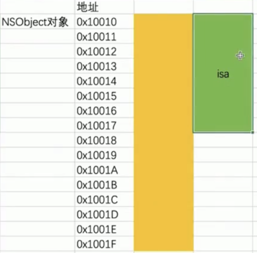
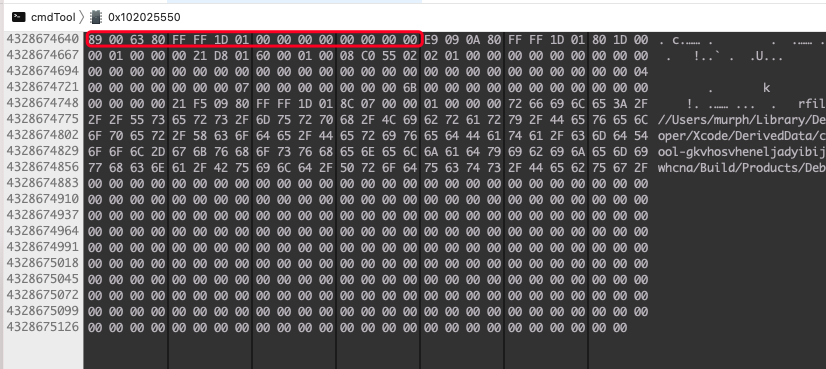
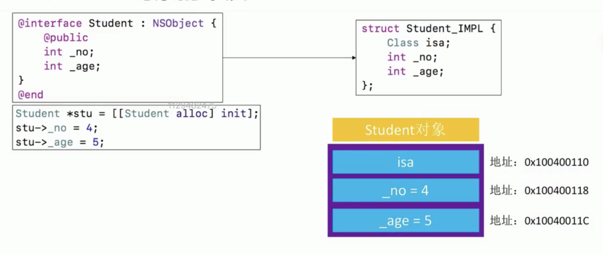

### OC的本质

- 我们平时编写的 Objective-C 的代码，底层实现其实都是 C\C++ 代码
- Objective-C 的面向对象都是基于 C\C++ 的数据结构实现的
- Objective-C 的对象、类都是基于 C\C++ 的结构体实现的

### OC 转 C\C++

OC 转为 C++ 代码
`lang -rewrite-objc main.m -o main.cpp`

OC 转为iPhone arm64 架构 C++ 代码
`xcrun -sdk iphoneos clang -arch arm64 -rewrite-objc main.m -o main.iphone64.cpp`

NSObject in Objective-C

```Objective-C
// NSObject 的定义
@interface NSObject {
    Class isa;
}
```

main.cpp
```C++
// NSObject Implementation in cpp file
struct NSObject_IMPL {
    CLass isa;
};

// Class 为指向结构体的指针
typedef struct objc_class *Class;
```

### 结构体内存分配原则

- 数据成员对其规则：结构体中的数据成员，第一个数据成员放在offset为0的地方，之后每个数据的起始位置都要从该成员大小或者其最大子成员大小的整数倍开始存储
- 结构体大小，必须为其内部最大成员的整数倍，不足的要补齐
- 初始化之后实际占用内存，还要遵循系统内存对其原则，现在一般为16字节对其

在定义结构体的时候，如果两个结构体有相同类型的成员，并且成员顺序不同，那么最终结构体所占用的内存是有可能不同的

代码：
```Objective-C
struct Struct1 {
    char a;     //1字节 -- 占据0字节
    double b;   //8字节 -- 占据8-15字节
    int c;      //4字节 -- 占据16-19字节
    short d;    //2字节 -- 占据20-22字节
} MyStruct1;    //共22字节，但22不是8的倍数，则+2，因为24是8的倍数

struct Struct2 {
    double b;   //8字节 -- 占据0-7字节
    int c;      //4字节 -- 占据8-11字节
    char a;     //1字节 -- 占据12字节
    short d;    //2字节 -- 占据14-15字节
} MyStruct2;    //共16字节，16是8的倍数所以总大小还是16字节


int main(int argc, const char * argv[]) {
    @autoreleasepool {
        NSLog(@"Struct1 size：%lu",sizeof(MyStruct1)); // 24
        NSLog(@"Struct2 size：%lu",sizeof(MyStruct2)); // 16
    }
    return 0;
}
```

### OC 中类的内存分配

由于 OC 中的类同样是基于 C\C++ 中结构体来实现的，所以 OC 中类的内存分配原则同结构体是一样的

> OC 中的成员变量与属性的区别
>> OC 中的成员变量在生成结构体的时候顺序与定义的顺序相同，但是属性在编译生成结构体的时候会有一个重排，保证类在遵循内存分配原则后占用内存最小，所以成员变量的顺序有可能会影响 OC 类最终内存占用大小，而属性的定义顺序不会。

上 🌰 

```Objective-C
@interface Cls1 : NSObject
@property (nonatomic, assign) double _b;
@property (nonatomic, assign) int _c;
@property (nonatomic, assign) char _a;
@property (nonatomic, assign) short _d;

@end

@implementation Cls1
@end

@interface Cls2 : NSObject
@property (nonatomic, assign) char _a;
@property (nonatomic, assign) double _b;
@property (nonatomic, assign) int _c;
@property (nonatomic, assign) short _d;
@end

@implementation Cls2
@end

int main(int argc, const char * argv[]) {
    @autoreleasepool {
        NSLog(@"Cls1 size：%lu, allocSize: %lu", class_getInstanceSize([Cls1 class]), malloc_size((__bridge const void *)([[Cls1 alloc] init])));
        NSLog(@"Cls2 size：%lu, allocSize: %lu", class_getInstanceSize([Cls2 class]), malloc_size((__bridge const void *)([[Cls2 alloc] init])));
    }
    return 0;
}

// output
// Cls1 size：24, allocSize: 32
// Cls2 size：24, allocSize: 32

//从上面例子中可以看到，虽然两个类定义的属性顺序同之前的两个 struct 相同，但是两个类最终占用的内存及系统最终分配的内存是相同的
```


我们来看一下生成 C++ 之后的代码

```C++
struct Cls1_IMPL {
	struct NSObject_IMPL NSObject_IVARS;
	char __a;
	short __d;
	int __c;
	double __b;
};

struct Cls2_IMPL {
	struct NSObject_IMPL NSObject_IVARS;
	char __a;
	short __d;
	int __c;
	double __b;
};

// 可以看到转成 C++ 代码之后，结构的成员顺序变成了一样的，这就证明了 OC 类在转为结构体的过程中会对属性进行重排，保证在满足内存分配规则的前提下保证内存占用最优
```

*但是如果给类添加成员变量会怎么样呢*
我们还是用代码来证明

```Objective-C
@interface Cls1 : NSObject
{
    char c;
    double d;
    int a;
    int b;

}
@property (nonatomic, assign) double _b;
@property (nonatomic, assign) int _c;
@property (nonatomic, assign) char _a;
@property (nonatomic, assign) short _d;
@property (nonatomic, assign) int _c1;

@end

@implementation Cls1
@end

@interface Cls2 : NSObject
{
    double d;
    int a;
    int b;
    char c;
}
@property (nonatomic, assign) char _a;
@property (nonatomic, assign) double _b;
@property (nonatomic, assign) int _c;
@property (nonatomic, assign) short _d;
@property (nonatomic, assign) int _c1;
@end

@implementation Cls2
@end

int main(int argc, const char * argv[]) {
    @autoreleasepool {  
        NSLog(@"Cls1 size：%lu, allocSize: %lu", class_getInstanceSize([Cls1 class]), malloc_size((__bridge const void *)([[Cls1 alloc] init])));
        NSLog(@"Cls2 size：%lu, allocSize: %lu", class_getInstanceSize([Cls2 class]), malloc_size((__bridge const void *)([[Cls2 alloc] init])));
    }
    return 0;
}
// output
// Cls1 size：56, allocSize: 64
// Cls2 size：48, allocSize: 48
```

我们继续来看一下生成的 C++ 代码

``` C++
struct Cls1_IMPL {
	struct NSObject_IMPL NSObject_IVARS;  // 0-7
	char c;                               // 8
	double d;                             // 16-23
	int a;                                // 24-27
	int b;                                // 28-31
	char __a;                             // 32
	short __d;                            // 34-35
	int __c;                              // 36-39
	int __c1;                             // 40-43
	double __b;                           // 48-55
};
// 最终占用 56 字节，实际内存分配 16对其，分配 64

struct Cls2_IMPL {
	struct NSObject_IMPL NSObject_IVARS; // 0-7
	double d;                            // 8-15
	int a;                               // 16-19
	int b;                               // 20-23
	char c;                              // 24
	char __a;                            // 25
	short __d;                           // 26-27
	int __c;                             // 28-32
	int __c1;                            // 36-39
	double __b;                          // 40-47
};
// 最终占用 48 字节，实际内存分配 16对其，分配 48

// 可以看到，转为 C++ 代码之后，成员变量并没有重排，而是保持了在 OC 类中定义的顺序，而属性依然会按照内存占用最优解进行重排
```

由于 OC 中所有的类都是继承自 NSObject，所以在 OC 类转为结构体之后，第一个成员都为 isa 指针，占 8 个字节，接下来是类的成员变量（按定义顺序存储），最后是重排后的属性；

NSObject 类的实例对象成员变量的大小为 8, 在 NSObject_IMPL 中也就是 isa 所占用的字节，NSObject在内存中实际占用的大小也为8，但是由于系统分配内存对其原则，实际为 NSObject 实例对象分配的内存则为 16

通过 `class_getInstanceSize([NSObject class])` 传入类对象，可以获取到类实际占用的内存
而通过 `malloc_size` 传入实例对象，返回的为系统为该实例对象实际分配的内存

```Objective-C
#import <Foundation/Foundation.h>
#import <objc/runtime.h>
#import <malloc/malloc.h>

int main(int argc, const char * argv[]) {
    @autoreleasepool {
        NSObject *obj = [[NSObject alloc] init];
        // 获取 NSObject 类的实例对象成员变量的大小 >> 8, 在 NSObject_IMPL 中也就是 isa 所占用的字节
        NSLog(@"%zd", class_getInstanceSize([NSObject class]));
//        class_getInstanceSize 实现
//        size_t class_getInstanceSize(Class cls)
//        {
//            if (!cls) return 0;
//            return cls->alignedInstanceSize();
//        }
//        Class's ivar size rounded up to a pointer-size boundary.
//        uint32_t alignedInstanceSize() const {
//            return word_align(unalignedInstanceSize());
//        }
        
        
        // 获取 obj 指针指向内存的大小 >> 16 （8个字节存isa指针，另外8个空）
        // malloc_size 获取分配内存的大小
        NSLog(@"%zd", malloc_size((__bridge const void *)(obj)));
    }
    return 0;
}

```



也可以通过debug来通过断点来查看obj的内存分配侧面来证明obj的内存占用情况

Debug-> Debug Workflow -> view memory，通过输入obj的内存地址来查看连续16个字节的内存占用情况，可以看到前8位是有值的，后8位为0




### Student 的本质




```Objective-C
@interface Student : NSObject{
    @public
    int _no;
    int _age;
}
@end

@implementation Student

@end

// Student Implementation
struct Student_IMPL {
    struct NSObject_IMPL NSObject_IVARS;
    int _no;
    int _age;
};

```

