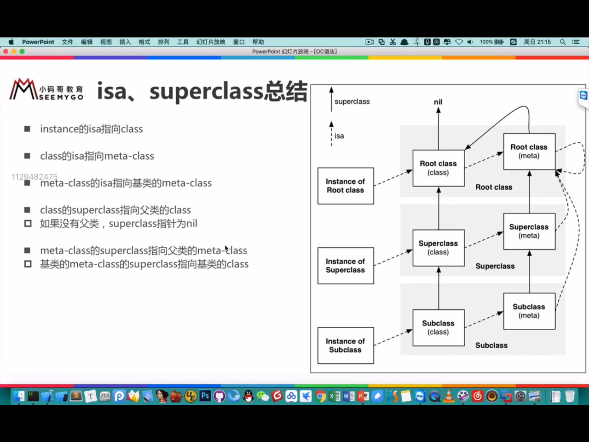

### isa 指针

> `instance` 的 `isa` 指向 `class`
>> 当调用*对象方法*时，通过 `instance` 的 `isa` 指针找到 `class`, 最后找到 *对象方法* 的实现进行调用

> `class` 的 `isa` 指向 `meta-class`
> > 当调用*类方法*时，通过 `class` 的 `isa` 找到 `meta-class`，最后找到*类方法*进行调用

### class 对象的 superclass 指针

类对象的 superclass 指针指向的是父类的类对象

`Student -> Person -> NSObject`

当 `Student` 的  `instance` 对象调用 `Person` 的对象方法时，会先通过 `isa` 找到 `Student` 的 `class`，然后通过 `superclass` 找到 `Person` 的 `class`，最后找到对象方法的实现进行调用 

### meta-class 对象的 superclass 指针

元类的`superclass`指针指向的是父类的元类对象

### isa、class、meta-class 总结
- instance 的 isa 指向 class
- class 的 isa 指向 meta-class
- meta-class 的 isa 指向基类(NSObject)的 meta-class
- class 的 superclass 指向父类的 class
- 如果没有父类 superclass 为 nil
- meta-class 的 superclss 指向父类的 meta-class
- 基类 meta-class 的 superclass 指向基类的 class

instance 方法调用轨迹

- isa 找到 class, 如果方法不存在就通过 superclass 到父类中查找，如果到基类还是找不到方法 则抛出错误

class 调用类方法的轨迹
- isa 找到 meta-class，如果方法不存在则通过 superclass 到父类查找，如果到基类的 meta-class还是找不到，则通过基类的 superclass 找到基类的 class 类对象，若还是没有则报错

从64bit开始，isa需要进行一次位运算，才能计算出真实地址 `&ISA_MASK`