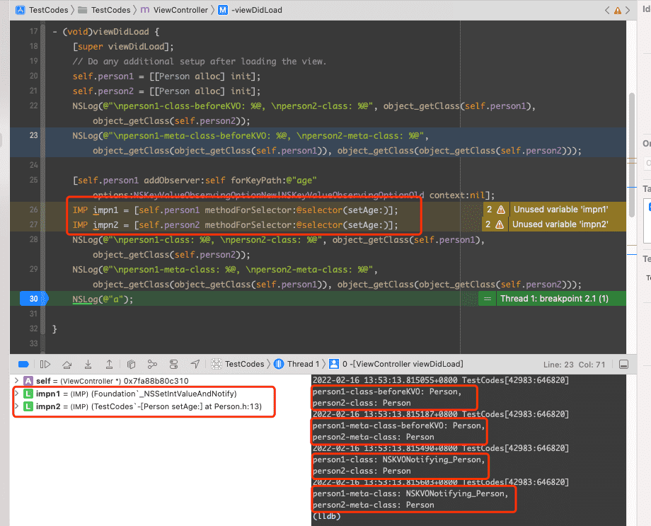
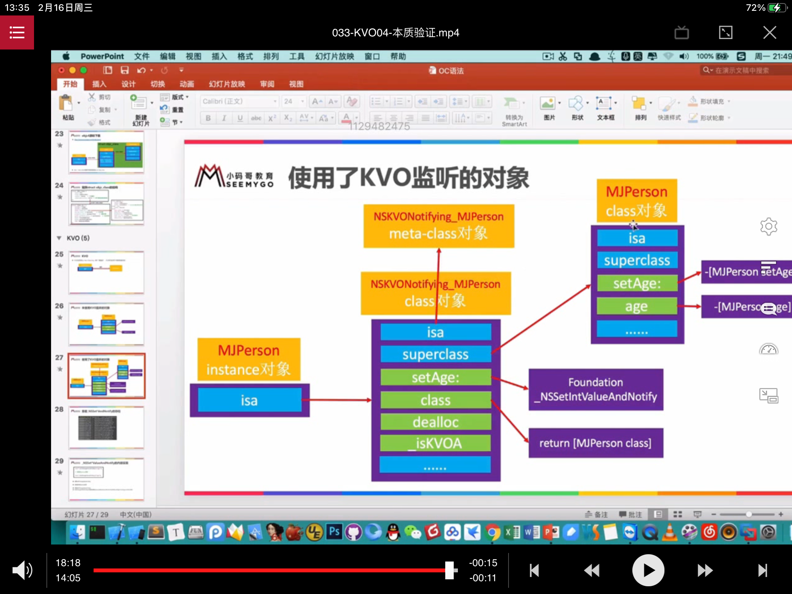

## KVO

KVO 的全称 Key-Value Observing，俗称 键值监听，用来监听某个对象属性值的改变

### 底层实现

```Objective-C
@interface Person : NSObject
@property(nonatomic, assign) int age;
@end

@implementation Person

@end
```

拿 `Person` 类来举例的话

`Person` 实例对象如果使用了 KVO，那么该实例对象的 isa 则会指向一个名叫 `NSKVONotifying_Person` 的类对象

`NSKVONotifying_Person` 类继承自 `Person`，也就是 `NSKVONotifying_Person` 类对象的 `superclass` 指针指向 `Person` 类对象

`NSKVONotifying_Person` 的 setAge 方法会指向Foundation 中的 _NSSetIntValueAndNotify 方法





### _NSSet*ValueAndNotify 的内部实现

`NSKVONotifying_Person` 中的实现大概如下：

```Objective-C
@implementation NSKVONotifying_Person

- (void) setAge: (int) age {
    _NSSetIntValueAndNotify()
}

void _NSSetIntValueAndNotify() {
    [self willChangeValueForKey:@"age"];
    [super setAge: age];
    [self didChangeValueForKey: @"age"];
}

// 屏蔽内部实现，隐藏 NSKVONotifying_Person 的存在，如果重写就会返回实际的类对象 NSKVONotifying_Person
-(Class)class {
    retrun [Person class];
}

-(void)dealloc {

}

-(BOOL)_isKVOA {
    return YES;
}
```


NSKeyValueObserving

``` Objective-C
@implementation NSObject (NSKeyValueObserverNotification)
-(void)didChangeValueForKey: (NSString*) key {
    // 当然这部分逻辑不是实现在该类中，而是在 Foundation 的 NSObject(NSKeyValueObserverNotification) 类扩展中实现的该逻辑，假如自己重写了didChangeValueForKey 方法，并且没有调用 [super didChangeValueForKey]，不能触发 KVO 的监听方法
    [observe observeValueForKeyPath:key ofObject:self change: change context: context]
}
@end
```

NSKVONotifying_Person 中重写的方法可以通过获取其中方法列表来查看

```Objective-C
#import <objc/runtime.h>

@implementation Utils 
+ (void) printMethodNamesOfClass: (Class) cls {
    unsigned int count;
    Method *methodList = class_copyMethodList(cls, &count);
    NSMutableString *methodNames = [NSMutableString string];
    
    for (int i = 0; i < count; i++) {
        Method method = methodList[i];
        NSString *methodName = NSStringFromSelector(method_getName(method));
        [methodNames appendFormat:@"%@ ", methodName];
    }
    NSLog(@"%@", methodNames);
}
@end

[Utils printMethodNamesOfClass: object_getClass(self.person1)];
```

添加监听器的对象在不改变监听属性改变的前提下触发 观察者监听方法，可以这样做

```
[self.person1 willChangeValueForKey:@"age"];
// didChangeValueForKey 中会有判断是否调用了 willChangeValueForKey，所以如果想触发 KVO 那么需要将两个方法一起调用才可以
[self.person1 didChangeValueForKey:@"age"];
```