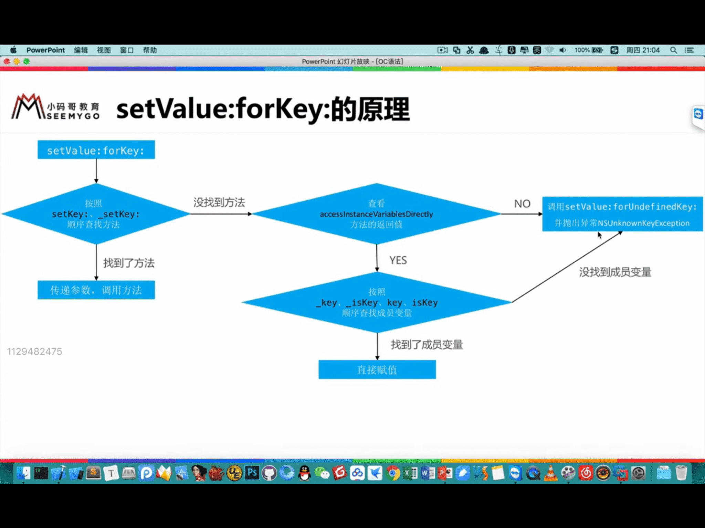
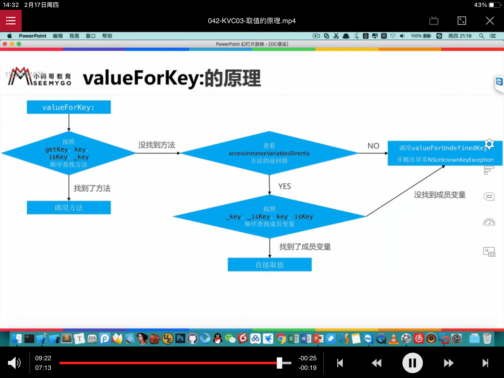

### KVC

KVC 全程 Key-Value Coding 俗称 “键值编码” ，可以通过一个 key 来访问某个属性

常见API

```Objective-C

- (void)setValue:(nullable id)value forKeyPath:(NSString *)keyPath;
- (void)setValue:(nullable id)value forKey:(NSString *)key;
- (nullable id)valueForKeyPath:(NSString *)keyPath;
- (nullable id)valueForKey:(NSString *)key;

```

### KVC 赋值过程

```Objective-C
/* Given a value and a key that identifies an attribute, set the value of the attribute. Given an object and a key that identifies a to-one relationship, relate the object to the receiver, unrelating the previously related object if there was one. Given a collection object and a key that identifies a to-many relationship, relate the objects contained in the collection to the receiver, unrelating previously related objects if there were any.

The default implementation of this method does the following:
    1. Searches the class of the receiver for an accessor method whose name matches the pattern -set<Key>:. If such a method is found the type of its parameter is checked. If the parameter type is not an object pointer type but the value is nil -setNilValueForKey: is invoked. The default implementation of -setNilValueForKey: raises an NSInvalidArgumentException, but you can override it in your application. Otherwise, if the type of the method's parameter is an object pointer type the method is simply invoked with the value as the argument. If the type of the method's parameter is some other type the inverse of the NSNumber/NSValue conversion done by -valueForKey: is performed before the method is invoked.
    2. Otherwise (no accessor method is found), if the receiver's class' +accessInstanceVariablesDirectly property returns YES, searches the class of the receiver for an instance variable whose name matches the pattern _<key>, _is<Key>, <key>, or is<Key>, in that order. If such an instance variable is found and its type is an object pointer type the value is retained and the result is set in the instance variable, after the instance variable's old value is first released. If the instance variable's type is some other type its value is set after the same sort of conversion from NSNumber or NSValue as in step 1.
    3. Otherwise (no accessor method or instance variable is found), invokes -setValue:forUndefinedKey:. The default implementation of -setValue:forUndefinedKey: raises an NSUndefinedKeyException, but you can override it in your application.

Compatibility notes:
    - For backward binary compatibility with -takeValue:forKey:'s behavior, a method whose name matches the pattern -_set<Key>: is also recognized in step 1. KVC accessor methods whose names start with underscores were deprecated as of Mac OS 10.3 though.
    - For backward binary compatibility, -unableToSetNilForKey: will be invoked instead of -setNilValueForKey: in step 1, if the implementation of -unableToSetNilForKey: in the receiver's class is not NSObject's.
    - The behavior described in step 2 is different from -takeValue:forKey:'s, in which the instance variable search order is <key>, _<key>.
    - For backward binary compatibility with -takeValue:forKey:'s behavior, -handleTakeValue:forUnboundKey: will be invoked instead of -setValue:forUndefinedKey: in step 3, if the implementation of -handleTakeValue:forUnboundKey: in the receiver's class is not NSObject's.
*/
- (void)setValue:(nullable id)value forKey:(NSString *)key;
```



即使没有类中没有属性，没有实现 set 方法，只要能正常调用 KVC， 那么也可以触发 KVO，KVC中从现象来看的话是实现了 KVO 的逻辑


### KVC 取值过程

```Objective-C
/* Given a key that identifies an attribute or to-one relationship, return the attribute value or the related object. Given a key that identifies a to-many relationship, return an immutable array or an immutable set that contains all of the related objects.
    
The default implementation of this method does the following:
    1. Searches the class of the receiver for an accessor method whose name matches the pattern -get<Key>, -<key>, or -is<Key>, in that order. If such a method is found it is invoked. If the type of the method's result is an object pointer type the result is simply returned. If the type of the result is one of the scalar types supported by NSNumber conversion is done and an NSNumber is returned. Otherwise, conversion is done and an NSValue is returned (new in Mac OS 10.5: results of arbitrary type are converted to NSValues, not just NSPoint, NRange, NSRect, and NSSize).
    2. (introduced in Mac OS 10.7). Otherwise (no simple accessor method is found), searches the class of the receiver for methods whose names match the patterns -countOf<Key> and -indexIn<Key>OfObject: and -objectIn<Key>AtIndex: (corresponding to the primitive methods defined by the NSOrderedSet class) and also -<key>AtIndexes: (corresponding to -[NSOrderedSet objectsAtIndexes:]). If a count method and an indexOf method and at least one of the other two possible methods are found, a collection proxy object that responds to all NSOrderedSet methods is returned. Each NSOrderedSet message sent to the collection proxy object will result in some combination of -countOf<Key>, -indexIn<Key>OfObject:, -objectIn<Key>AtIndex:, and -<key>AtIndexes: messages being sent to the original receiver of -valueForKey:. If the class of the receiver also implements an optional method whose name matches the pattern -get<Key>:range: that method will be used when appropriate for best performance.
    3. Otherwise (no simple accessor method or set of ordered set access methods is found), searches the class of the receiver for methods whose names match the patterns -countOf<Key> and -objectIn<Key>AtIndex: (corresponding to the primitive methods defined by the NSArray class) and (introduced in Mac OS 10.4) also -<key>AtIndexes: (corresponding to -[NSArray objectsAtIndexes:]). If a count method and at least one of the other two possible methods are found, a collection proxy object that responds to all NSArray methods is returned. Each NSArray message sent to the collection proxy object will result in some combination of -countOf<Key>, -objectIn<Key>AtIndex:, and -<key>AtIndexes: messages being sent to the original receiver of -valueForKey:. If the class of the receiver also implements an optional method whose name matches the pattern -get<Key>:range: that method will be used when appropriate for best performance.
    4. (introduced in Mac OS 10.4). Otherwise (no simple accessor method or set of ordered set or array access methods is found), searches the class of the receiver for a threesome of methods whose names match the patterns -countOf<Key>, -enumeratorOf<Key>, and -memberOf<Key>: (corresponding to the primitive methods defined by the NSSet class). If all three such methods are found a collection proxy object that responds to all NSSet methods is returned. Each NSSet message sent to the collection proxy object will result in some combination of -countOf<Key>, -enumeratorOf<Key>, and -memberOf<Key>: messages being sent to the original receiver of -valueForKey:.
    5. Otherwise (no simple accessor method or set of collection access methods is found), if the receiver's class' +accessInstanceVariablesDirectly property returns YES, searches the class of the receiver for an instance variable whose name matches the pattern _<key>, _is<Key>, <key>, or is<Key>, in that order. If such an instance variable is found, the value of the instance variable in the receiver is returned, with the same sort of conversion to NSNumber or NSValue as in step 1.
    6. Otherwise (no simple accessor method, set of collection access methods, or instance variable is found), invokes -valueForUndefinedKey: and returns the result. The default implementation of -valueForUndefinedKey: raises an NSUndefinedKeyException, but you can override it in your application.

Compatibility notes:
    - For backward binary compatibility, an accessor method whose name matches the pattern -_get<Key>, or -_<key> is searched for between steps 1 and 3. If such a method is found it is invoked, with the same sort of conversion to NSNumber or NSValue as in step 1. KVC accessor methods whose names start with underscores were deprecated as of Mac OS 10.3 though.
    - The behavior described in step 5 is a change from Mac OS 10.2, in which the instance variable search order was <key>, _<key>.
    - For backward binary compatibility, -handleQueryWithUnboundKey: will be invoked instead of -valueForUndefinedKey: in step 6, if the implementation of -handleQueryWithUnboundKey: in the receiver's class is not NSObject's.
*/
- (nullable id)valueForKey:(NSString *)key;
```

