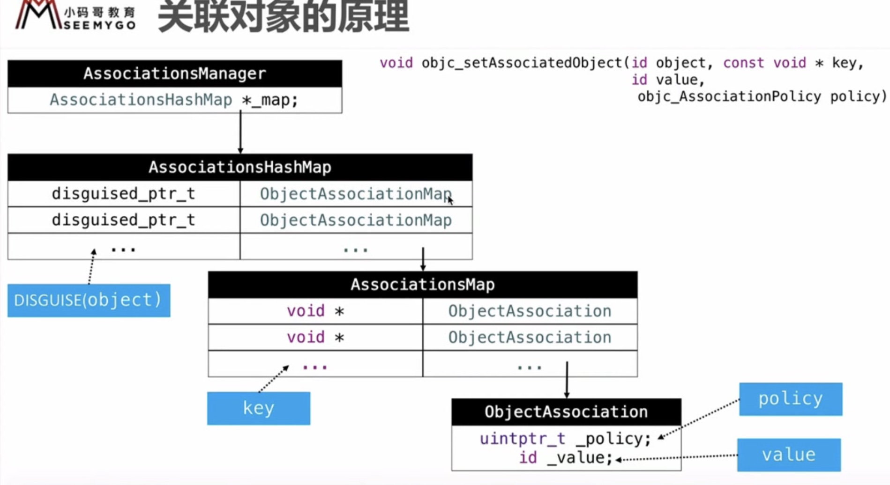

## 关联对象

### 分类中的属性

属性写在类中的话，会自动生成 _[属性名] 的成员变量，以及成员变量的 `get` `set` 方法
```Objective-C
@interface Person: NSObject{
    int _age;
}
@property(assign, nonatomic) int age;

-(void)setAge:(int)age;
-(int)age 

@end

@implement Person
-(void)setAge:(int)age {
    _age = age;
}
-(int)age{
    return _age;
}
@end
```

但是如果属性写在分类中的话，只会生成属性 `get` `set` 方法的声明

```Objective-C
@interface Person(Test)

@property(assign, nonatomic) int age;

-(void)setAge:(int)age;
-(int)age 

@end
```

### 关联对象方式给分类添加属性

通过 runtime 关联对象的方式添加属性

``` C++
// 设置关联对象
objc_setAssociatedObject(id _Nonnull object, const void * _Nonnull key,
                         id _Nullable value, objc_AssociationPolicy policy)
// 获取关联对象
objc_getAssociatedObject(id _Nonnull object, const void * _Nonnull key)

// 移除所有关联对象
_object_remove_assocations(id object, bool deallocating)
```

| objc_AssociationPolicy | 对应修饰符 |
|--|--|
| OBJC_ASSOCIATION_ASSIGN | assign |
| OBJC_ASSOCIATION_RETAIN_NONATOMIC | strong, nonatomic |
| OBJC_ASSOCIATION_COPY_NONATOMIC | copy, assign |
| OBJC_ASSOCIATION_RETAIN | strong, atomic |
| OBJC_ASSOCIATION_COPY | copy, atomic |


```Objective-C
@interface Person (Action)
@property (nonatomic, assign) int age;
@end

#import "Person+Action.h"
#import <objc/runtime.h>

@implementation Person (Action)
// static 保证作用于为当前文件，防止被其他文件访问
// 由于 objc_setAssociatedObject，objc_getAssociatedObject 的key 参数需要一个 const void *
// 定义一个 char 类型的常量，并将其地址传入可以占用更少的内存空间
// 由于直接 @"String" 这种方式定义的字符串都存在常量区，所以，无论写多少遍，指向的都是同一个地址，所以也可以用直接 传 字符串常量的方式来传入 key
// 也可以直接传入该属性的 get 方法来当做key 的值 @selector(key)
static const char valueAge;

- (void)setAge:(int)age {
    objc_setAssociatedObject(self, &valueAge, @(age), OBJC_ASSOCIATION_ASSIGN);
    // 或者直接用字符串常量
    objc_setAssociatedObject(self,@"age", @(age), OBJC_ASSOCIATION_ASSIGN);
    // 直接用 get 方法作为 key
    objc_setAssociatedObject(self,@selector(age), @(age), OBJC_ASSOCIATION_ASSIGN);
}
- (int)age {
    return [objc_getAssociatedObject(self, &valueAge) intValue];
    // get 也直接用字符串常量
    return [objc_getAssociatedObject(self, @"age") intValue];
    // 直接用 get 方法作为 key
    return [objc_getAssociatedObject(self, @selector(age)) intValue];
}
@end
```

通过 `objc_setAssociatedObject` 设置关联对象，是不会修改原来类的结构的，而是将关联的对象单独存储

### 关联对象的实现

实现关联对象的核心对象有如下几个

- AssociationsManager
- AssociationsHashMap
- ObjectAssociationMap
- ObjcAssociation

```C++

typedef DenseMap<DisguisedPtr<objc_object>, ObjectAssociationMap> AssociationsHashMap;
typedef DenseMap<const void *, ObjcAssociation> ObjectAssociationMap;

class AssociationsManager {
    using Storage = ExplicitInitDenseMap<DisguisedPtr<objc_object>, ObjectAssociationMap>; // 它其实就是 AssociationsHashMap
    static Storage _mapStorage;
}

class ObjcAssociation {
    uintptr_t _policy;
    id _value;
}
```

- 关联对象并不是存储在被关联对象本身的内存
- 关联对象存储在全局统一的一个 `AssociationsManager` 中
- 设置关联对象为 `nil`, 则触发移除关联对象
- 对象销毁，关联对象就会被自动移除


