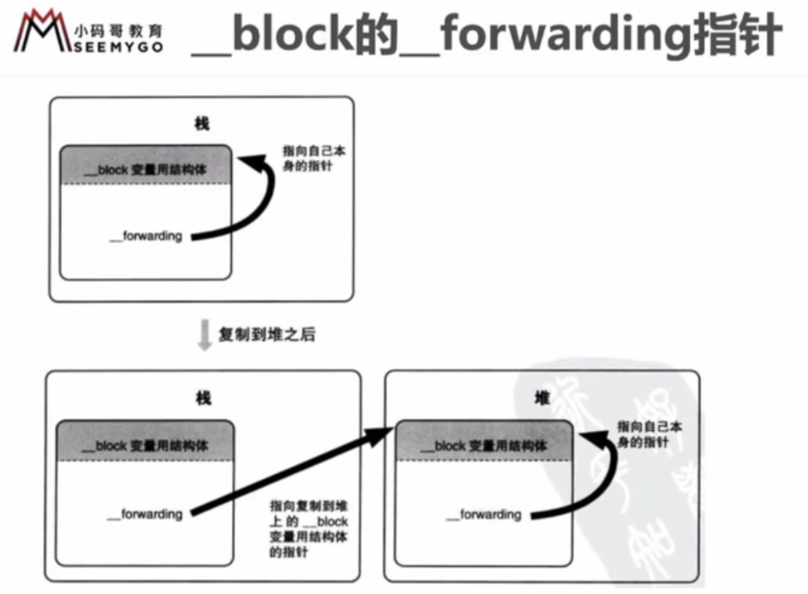
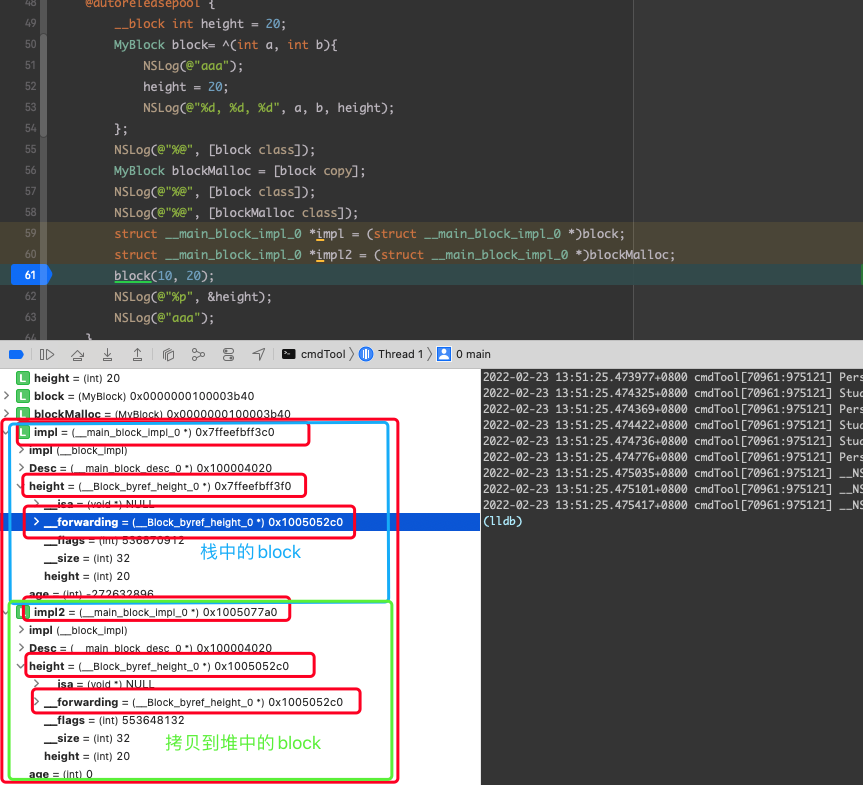

## Block

### Block 的本质

- block 本质上也是一个 OC 对象，它的内部也有一个 isa 指针
- block 是封装了函数调用以及函数调用环境的 OC 对象
- block 底层结构如下

```Objective-C
int main(int argc, const char * argv[]) {
    @autoreleasepool {
        int age = 10;
        // 在定义 block 的时候 age 的值就已经捕获（capture）进来，
        // 在这之后 age 如何变，block 中的的值也不会改变
        void (^block)(int, int) = ^(int a, int b){
            NSLog(@"aaa");
            NSLog(@"%d, %d, %d", age, a, b);
        };
        
        block(10, 20); 
    }
    return 0;
}

```


```C++
int main(int argc, const char * argv[]) {
    /* @autoreleasepool */ { __AtAutoreleasePool __autoreleasepool; 
        int age = 10;
        // 实例化 __main_block_impl_0，传入 __block_impl 对象, 方法对象，desc指针，以及 block 中引用的局部变量
        // __main_block_func_0 赋值给 __block_impl->FuncPtr,
        // __main_block_desc_0_DATA 赋值给 __main_block_impl_0 -> Desc
        // age 赋值给 __main_block_desc_0 成员变量 age
        void (*block)(int, int) = ((void (*)(int, int))&__main_block_impl_0((void *)__main_block_func_0, &__main_block_desc_0_DATA, age));
        
        void (*block)(int, int) = &__main_block_impl_0(
          __main_block_func_0, 
          &__main_block_desc_0_DATA, 
          age
        )); // 初始化一个结构体并将结构体的地址返回给 block
        

        // (void (*)(__block_impl *, int, int)) 强转 
        // (__block_impl *)block block 强转为 (__block_impl *)
        // 由于 __block_impl 是 __main_block_impl_0 的第一个成员，
        // 所以，block 的地址也是 __block_impl 的地址
        // 所以将 __main_block_impl_0 强制转换为 __block_impl 是没有问题的
        ((void (*)(__block_impl *, int, int))((__block_impl *) block) -> FuncPtr )((__block_impl *)block, 10, 20);
        // 去掉强转之后简化为
        (block->FuncPtr)(block, 10, 20);

    }
    return 0;
}

struct __block_impl {
  void *isa;
  int Flags;
  int Reserved;
  void *FuncPtr;
};

static struct __main_block_desc_0 {
  size_t reserved;
  size_t Block_size;
} __main_block_desc_0_DATA = { 0, sizeof(struct __main_block_impl_0)};

struct __main_block_impl_0 {
  struct __block_impl impl;
  struct __main_block_desc_0* Desc;
  int age;

  // 构造函数（类似于 OC 的 init 方法），返回结构体对象
  __main_block_impl_0(void *fp, struct __main_block_desc_0 *desc, int _age, int flags=0) : age(_age) {
    impl.isa = &_NSConcreteStackBlock;
    impl.Flags = flags;
    impl.FuncPtr = fp;
    Desc = desc;
  }
};

```


为了保证 block 内部能够正常访问外部的变量， block 有个变量捕获机制

| 变量类型  | | 捕获到 block 内部 | 访问方式 |
|--|--|--|--|
| 局部变量 | auto | true | 值传递
|  | static | true | 指针传递 |
全局变量  | | false | 直接访问


> 局部变量
- auto 局部变量作用域结束时就被销毁了，当调用 block 的时候可能 auto 的局部变量已经被销毁了，所以声明 block 时就直接将其值捕获进来
- static 局部变量初始化之后就一直在内存中，所以不需要担心其被销毁，所以需要捕获其指针，来访问 static 局部变量
- 如果捕获对象的属性，那么直接捕获对象本身 

> 全局变量
  
- 初始化之后一直存在于内存中，任何地方都可以访问到，所以不需要捕获，直接访问即可


```Objective-C
const int test = 100;

int main(int argc, const char * argv[]) {
    @autoreleasepool {
        // 随时可能被销毁，当调用 block 的时候可能 auto 的变量已经被销毁了，所以声明 block 时就直接将其值捕获进来
        int age = 10; 
        // 而 static 变量初始化之后就一直在内存中，所以不需要担心其被销毁，所以只捕获其指针就不会有问题
        static int weight = 30;
        void (^block)(int, int) = ^(int a, int b){
            NSLog(@"aaa");
            NSLog(@"%d, %d, %d, %d, %d, %d", age, a, b, weight, test);
        };
        block(10, 20);
        
    }
    return 0;
}
```

```C++
struct __main_block_impl_0 {
  struct __block_impl impl;
  struct __main_block_desc_0* Desc;
  // 变量类型为 auto 的话，只捕获值
  int age;
  // 这里可以看到，如果 block 访问 static 变量的话就会将 static 变量的指针捕获进来，
  int *weight; 
  NSString *str;
  __main_block_impl_0(void *fp, struct __main_block_desc_0 *desc, int _age, int _height, int *_weight, NSString *_str, int flags=0) : age(_age), weight(_weight), str(_str) {
    impl.isa = &_NSConcreteStackBlock;
    impl.Flags = flags;
    impl.FuncPtr = fp;
    Desc = desc;
  }
};
```

### block 类型

Block 有 3 中类型，可以通过调用 class 的方法或者 isa 指针查看具体类型，最终都继承自 NSBlock 类型, NSBlock 又继承自 NSObject 

- __NSGlobalBlock__ (_NSConcreteGlobalBlock)
- __NSStackBlock__ (_NSConcreteStackBlock)
- __NSMallocBlock__ (_NSConcreteMallocBlock)

应用程序内存分配


| 内存地址由小到大 | 存放的block 类型 | 定义方式|
|---| --- | --- |
| 程序区域 .text区，存放编写的代码 | | |
| 数据区域 .data 区， 存放全局变量  | _NSConcreteGlobalBlock |  没有访问 auto 变量 |
| 堆， 存放 alloc 出来的对象，动态分配内存，需要开发者来申请内存，也需要程序员自己管理内存 | _NSConcreteMallocBlock | _NSConcreteStackBlock 调用 copy | 
| 栈，存放局部变量，系统自动分配内存，系统也会自动销毁内存，例如 int i = 10 | _NSConcreteStackBlock | 访问了 auto 变量 （不使用 ARC）|


由于 _NSConcreteStackBlock 存放在栈，所以出了该 block 声明的作用域，block 所占用的内存就会被释放，所以，在 MRC 下调用 _NSConcreteStackBlock 可能会有意想不到的结果，_NSConcreteStackBlock 调用了 copy 之后就会升级为 _NSConcreteMallocBlock，也就将其存到了堆，其占用内存就交由我们自己来维护了。

| block 类型 | 环境 | 副本源的配置存储域| 复制效果|
| --- | --- | --- | --- |
| __NSGlobalBlock__ | 没有访问 auto 变量 | 栈 | 从栈复制到堆 |
| __NSStackBlock__ | 有访问 auto 变量 | 程序的数据区域 | 什么也不做 |
| __NSMallocBlock__ | __NSStackBlock__ 调用 copy | 堆 | 引用计数增加 | 


### block 的 copy

> 在 ARC 环境下，编译器会根据情况自动将栈中的 block 复制到堆上
- block 作为返回值时
- block 赋值给 __strong 指针时
- block 作为 Cocoa API 中方法名含有 usingBlock 方法参数时

```Objective-C
typedef void (^MyBlock)(void);

MyBlock myBlock() {
  int age = 10;
  return ^{
    NSLog(@">>>>>>>> %d", age);
  }
}

int main(int argc, const char * argv[]) {
  @autorelease{
    int age = 10;
    MyBlock block2 = ^{
      NSLog(@">>>>>>>> %d", age);
    } 
    // block 作为返回值时
    [myBlock() class];
    // block 赋值给 __strong 指针时
    [block2 class];
  }
}

```

> 使用 clang 转换 OC 为 C++ 代码时，可能会遇到以下问题
> 
> cannot create __weak reference in file useing manual reference
> 
> 解决方案：支持 ACR、指定运行时系统版本，比如
> 
>` xcrun -sdk iphoneos clang -arch arm64 -rewrite-objc -fobjc-arc -fobjc-runtime=ios-8.0.0 main.m`

### 对象类型的 auto 变量

> 当 block 内部访问了对象类型的 auto  变量时
- 如果 block 是在栈上，将不会对 auto 变量产生强引用？ （难道不是：由于 block 在栈上，即使对 auto 变量产生了强引用，但是由于在离开作用域之后 block 自己本身就已经被销毁了，block 对对象类型的 auto 变量引用也就没有了，那么也就无从谈起强弱引用了，谈栈中的强弱引用就没有意义？本身就是系统管理的，出了作用域全玩完）
- 如果 block 被拷贝到堆上
- - 会调用 block 内部的 copy 函数
- - copy 函数内部会调用 _Block_object_assign 函数
- - _Block_object_assign 函数会根据 auto 变量的修饰符 （__strong, __weak, __unsafe_unretained）作出响应的操作，类似于 retain （形成强引用、弱引用）
- 如果 block 从堆上移除
- - 会调用 block 内部的 dispose 函数
- - dispose 函数内部会调用 _Block_object_dispose 函数
- - _Block_object_dispose 函数会自动释放引用的 auto 变量，类似于 release

| 函数 | 调用时机 |
| --- | --- |
| copy 函数 | 栈上的 Block 复制到堆时 |
| dispose 函数 | 栈上的 Block 被废弃时 |

如果 block 中引用了 对象类型的变量，那么 `__main_block_desc_0` 中就多出了

`void (*copy)(struct __main_block_impl_0*, struct __main_block_impl_0*)` 


`void (*dispose)(struct __main_block_impl_0*)` 

用来对 block 内部引用的对象进行内存管理操作

```C++
static struct __main_block_desc_0 {
  size_t reserved;
  size_t Block_size;
  void (*copy)(struct __main_block_impl_0*, struct __main_block_impl_0*);
  void (*dispose)(struct __main_block_impl_0*);
} __main_block_desc_0_DATA = { 0, sizeof(struct __main_block_impl_0), __main_block_copy_0, __main_block_dispose_0};
```

### block 修改变量的值 (__block)

block 默认只能修改 static 变量或者全局变量，但是这样做并不好，static 修饰的变量不能被销毁，会一直存在于内存中，而仅为了使用 block  修改变量值就将变量搞成全局的同样是不好的，而切也有 static 变量的问题不会被销毁

#### __block 修饰符

- __block 可以用于解决 block 内部无法修改 auto 变量值的问题
- __block 不能修饰全局变量、静态变量(static)
- 编译器会将 __block 包装成一个对象

```Objective-C
int main(int argc, const char * argv[]) {
    @autoreleasepool {
        __block int height = 20;
        void (^block)(int, int) = ^(int a, int b){
            NSLog(@"aaa");
            height = 20;
            NSLog(@"%d, %d, %d", age, a, b, height);
        };
        block(10, 20);
        NSLog(@"%p", &height); // 拿到的地址就是最终包装完结构体内部 height 成员的地址
    }
    return 0;
}
```

```C++
// height 最终被包装成对象的结构
struct __Block_byref_height_0 {
  void *__isa;
__Block_byref_height_0 *__forwarding;
 int __flags;
 int __size;
 int height;
};

struct __main_block_impl_0 {
  struct __block_impl impl;
  struct __main_block_desc_0* Desc;
  __Block_byref_height_0 *height; // by ref
  __main_block_impl_0(void *fp, struct __main_block_desc_0 *desc, __Block_byref_height_0 *_height, int flags=0) : height(_height->__forwarding) {
    impl.isa = &_NSConcreteStackBlock;
    impl.Flags = flags;
    impl.FuncPtr = fp;
    Desc = desc;
  }
};

static void __main_block_func_0(struct __main_block_impl_0 *__cself, int a, int b) {
  __Block_byref_height_0 *height = __cself->height; // bound by ref

    NSLog((NSString *)&__NSConstantStringImpl__var_folders_hz_1frfmmyx7q3_8dv6845_7pgc0000gp_T_main_621f5c_mi_0);
    // height 的修改
    (height->__forwarding->height) = 20;
    NSLog((NSString *)&__NSConstantStringImpl__var_folders_hz_1frfmmyx7q3_8dv6845_7pgc0000gp_T_main_621f5c_mi_1, a, b, (height->__forwarding->height));
}

int main(int argc, const char * argv[]) {
    /* @autoreleasepool */ { __AtAutoreleasePool __autoreleasepool; 
        __attribute__((__blocks__(byref))) __Block_byref_height_0 height = {
          (void*)0, // __Block_byref_height_0 ->__isa
          (__Block_byref_height_0 *)&height, // __Block_byref_height_0 -> __forwarding 可以看到 __forwarding 的指针指向它自己
           0, // __Block_byref_height_0 -> __flags
          sizeof(__Block_byref_height_0), // __Block_byref_height_0 -> __size
          20 // __Block_byref_height_0 -> height
        };
        void (*block)(int, int) = ((void (*)(int, int))&__main_block_impl_0((void *)__main_block_func_0, &__main_block_desc_0_DATA, (__Block_byref_height_0 *)&height, 570425344));

        ((void (*)(__block_impl *, int, int))((__block_impl *)block)->FuncPtr)((__block_impl *)block, 10, 20);

        // NSLog(@"%p", &height); 的最终实现
        NSLog((NSString *)&__NSConstantStringImpl__var_folders_hz_1frfmmyx7q3_8dv6845_7pgc0000gp_T_main_990137_mi_2, &(height.__forwarding->height));

    }
    return 0;
}
```

如果使用 __block 修饰对象类型的变量的话，最终包装后的对象如下，多出两个方法来做内存管理
```C++
struct __Block_byref_obj_1 {
  void *__isa;
__Block_byref_obj_1 *__forwarding;
 int __flags;
 int __size;
 // 对象的内存管理
 void (*__Block_byref_id_object_copy)(void*, void*);
 void (*__Block_byref_id_object_dispose)(void*);
 NSObject *obj;
};
```

访问 __block 修饰的 auto 变量的话，其实最终访问到的就是包装成的结构体中的对应成员地址，而不是结构体，对于外部的访问已经屏蔽调了底层的实现，对于上层编程来说，拿到的最终还是 auto 变量本身，只是在其底层实现中封装了一层结构体，来保证其在堆内存中，不会被系统释放掉


### block 内存管理

> block 在栈上时，不会对 __block 产生强引用 (它自己都保不住，就无从谈强引用了)

> 当 block 被 copy 到堆时
- 会调用 block 的 copy 函数
- copy 函数内部会调用 _Block_object_assign 函数
- _Block_object_assign 函数会对 __block 变量形成强引用 （retain）
> 当 block 从堆上移除
- - 会调用 block 内部的 dispose 函数
- - dispose 函数内部会调用 _Block_object_dispose 函数
- - _Block_object_dispose 函数会自动释放引用的 __block 变量，类似于 release


 ### 对象类型的 auto 变量、 __block 变量

> 当 block 在栈上时，对他们都不会产生强引用
> 
> 当 block 被拷贝到堆时，都会通过 copy 函数来处理它们
- __block 变量
- - `_Block_object_assign((void*)&dst->height, (void*)src->height, 8/*BLOCK_FIELD_IS_BYREF*/);`
- 对象类型的 auto 变量
- - `_Block_object_assign((void*)&dst->obj, (void*)src->obj, 3/*BLOCK_FIELD_IS_OBJECT*/);`
> 当 block 从堆上移除，都会通过 dispose 函数来释放它们
- __block 变量
- - `_Block_object_dispose((void*)src->height, 8/*BLOCK_FIELD_IS_BYREF*/)`
- 对象类型的 auto 变量
- - `_Block_object_dispose((void*)src->obj, 3/*BLOCK_FIELD_IS_OBJECT*/);`


| | |
|--|--|
| 对象 | BLOCK_FIELD_IS_OBJECT|
| __block 变量 | BLOCK_FIELD_IS_BYREF|

### __block 的 __forwarding 指针指向自己



经试验可以看到，当栈上的block 拷贝到堆上时，栈上的 block 中的 __forwarding 指针会指向 堆上 block 的 `__Block_byref_obj_1`，这样可以保证在 copy 之后无论是访问 栈上的 block 副本还是访问堆上的block 副本，拿到的 __block 变量都是同一份



### __block 修饰的对象类型

__block 修饰的对象类型在 MRC 下包装后的类对于对象的引用一直是弱的，但是直接使用对象就不会有这种问题，block 内部会自动按引用对象的类型来处理强弱引用
如果是 ARC 下的话那就根据 __block 修饰的对象强弱来决定最终的引用是强还是弱

### 循环引用

#### ARC 环境下

```Objective-C

typedef (^TestBlock)();

@interface Person : NSObject
@property(copy, nonatomic) TestBlock block;
@property(assign, nonatomic) int age;

-(void) test;
@end

@implementation Person
-(void) test {
  // 这种写法，如果外部调用了test，那么也会产生循环引用，导致 person 无法释放
  // 或 __weak typeof(self) weakSelf = self;
  // 然后在 block 内部使用 weakSelf
  self.block = ^{
    NSLog(@“%d”, self.age);
    //或者 
    NSLog(@“%d”, _age);
  }
  
  
}
@end


int main(int argc, const char * argv[]) {
    @autoreleasepool {
        Person *p = [[Person alloc] init];
        p.age = 10;
        // 比如这样，p的属性 block 中使用了 p 的属性
        // 那么 block 作为 p 的属性，block 对 p 有一个强引用
        // block 中使用了 p 的属性，那么 block 对象中也会有一个对 p 的强引用
        // 这样就产生了循环引用，导致 p 无法释放
        // 假如 定义一个 __weak Person *weakP = p 或 __weak typeof(p) weakP = p;
        // 在 block 中使用 weakP，这样 block 对于 p 的引用就是弱引用，就不会有循环引用的问题
        p.block = ^{
            NSLog(@"%d", p.age);
        };
    }
    return 0;
}
```

__weak，直接用弱指针指向对象，如果对象释放，那么指针置位 nil

也可以使用 __unsafe__unretained，不会产生强引用，不安全，但是指针指向的对象销毁时，指针存的地址不变，对象释放之后再访问会有野指针的问题
当然也可以使用 __block 对象来解决，但是在block 中使用完使用完 __block 对象之后要对 __block 修饰的对象置 nil

```Objective-C
__block Person *p = [[Person alloc] init];
p.age = 10;
p.block = ^{
  NSLog(@"%d", p.age);
  p = nil;
}
person.block();

```

#### MRC 环境下

MRC 不支持 __weak
可以使用 __unsafe__unretained
或者使用 __block 来修饰对象（MRC __block 包装之后的对象不会对对象进行 retain 也就不会产生强引用，所以用 __block 也不需要像 ARC 下。对对象值 nil 并且运行 block）
```Objective-C
// MRC换将下直接这么搞就可以
__block Person *p = [[Person alloc] init];
p.age = 10;
p.block = ^{
  NSLog(@"%d", p.age);
}
person.block();
```