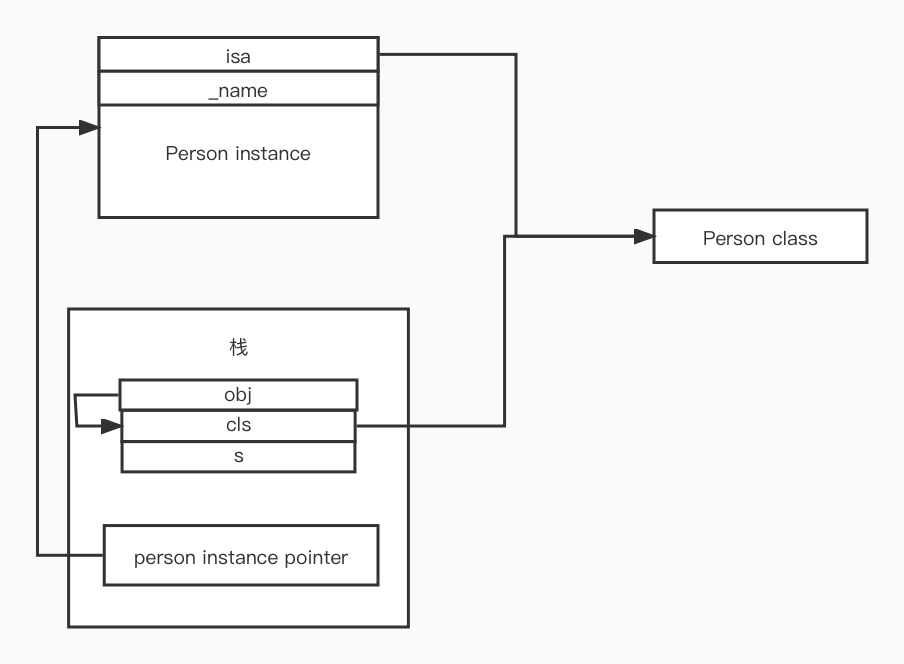

## runtime

Objective-C 是一门动态性比较强的语言，跟 C，C++ 有很大不同

常规语言的过程 编写代码 -> 编译链接 -> 运行

OC 引入了 runtime 机制，运行时

Objective-C 的动态性是由 Runtime API 来支持的

Runtime API 提供的接口基本都是 C 语言的，源码由 C\C++\汇编语言编写

### isa 详解

- 要学习 Runtime，首先要了解它底层的一些常用的数据结构，比如 isa 指针
- 在 arm64 架构之前，isa 就是一个普通的指针，存储这 Class、Meta-Class 对象的内存地址
- 从 arm64 架构开始，对 isa 进行了优化，变成了一个共用体（union）结构，还使用位域来存储更多的信息

runtime 中 object 的结构
```C++
struct objc_object {
private:
    isa_t isa;
}

union isa_t {
    isa_t() { }
    isa_t(uintptr_t value) : bits(value) { }
    uintptr_t bits;
private:
    // Accessing the class requires custom ptrauth operations, so
    // force clients to go through setClass/getClass by making this
    // private.
    Class cls;

public:
#if defined(ISA_BITFIELD)
    struct {
        ISA_BITFIELD;  // defined in isa.h
    };

    bool isDeallocating() {
        return extra_rc == 0 && has_sidetable_rc == 0;
    }
    void setDeallocating() {
        extra_rc = 0;
        has_sidetable_rc = 0;
    }
#endif

    void setClass(Class cls, objc_object *obj);
    Class getClass(bool authenticated);
    Class getDecodedClass(bool authenticated);
};

# if __arm64__
// ARM64 simulators have a larger address space, so use the ARM64e
// scheme even when simulators build for ARM64-not-e.
#   if __has_feature(ptrauth_calls) || TARGET_OS_SIMULATOR
#     define ISA_MASK        0x007ffffffffffff8ULL
#     define ISA_MAGIC_MASK  0x0000000000000001ULL
#     define ISA_MAGIC_VALUE 0x0000000000000001ULL
#     define ISA_HAS_CXX_DTOR_BIT 0
#     define ISA_BITFIELD                                                      \
        uintptr_t nonpointer        : 1;                                       \
        uintptr_t has_assoc         : 1;                                       \
        uintptr_t weakly_referenced : 1;                                       \
        uintptr_t shiftcls_and_sig  : 52;                                      \
        uintptr_t has_sidetable_rc  : 1;                                       \
        uintptr_t extra_rc          : 8
#     define RC_ONE   (1ULL<<56)
#     define RC_HALF  (1ULL<<7)
#   else
#     define ISA_MASK        0x0000000ffffffff8ULL
#     define ISA_MAGIC_MASK  0x000003f000000001ULL
#     define ISA_MAGIC_VALUE 0x000001a000000001ULL
#     define ISA_HAS_CXX_DTOR_BIT 1
#     define ISA_BITFIELD                                                      \
        uintptr_t nonpointer        : 1;                                       \
        uintptr_t has_assoc         : 1;                                       \
        uintptr_t has_cxx_dtor      : 1;                                       \
        uintptr_t shiftcls          : 33; /*MACH_VM_MAX_ADDRESS 0x1000000000*/ \
        uintptr_t magic             : 6;                                       \
        uintptr_t weakly_referenced : 1;                                       \
        uintptr_t unused            : 1;                                       \
        uintptr_t has_sidetable_rc  : 1;                                       \
        uintptr_t extra_rc          : 19
#     define RC_ONE   (1ULL<<45)
#     define RC_HALF  (1ULL<<18)
#   endif

# elif __x86_64__
#   define ISA_MASK        0x00007ffffffffff8ULL
#   define ISA_MAGIC_MASK  0x001f800000000001ULL
#   define ISA_MAGIC_VALUE 0x001d800000000001ULL
#   define ISA_HAS_CXX_DTOR_BIT 1
#   define ISA_BITFIELD                                                        \
      uintptr_t nonpointer        : 1;                                         \
      uintptr_t has_assoc         : 1;                                         \
      uintptr_t has_cxx_dtor      : 1;                                         \
      uintptr_t shiftcls          : 44; /*MACH_VM_MAX_ADDRESS 0x7fffffe00000*/ \
      uintptr_t magic             : 6;                                         \
      uintptr_t weakly_referenced : 1;                                         \
      uintptr_t unused            : 1;                                         \
      uintptr_t has_sidetable_rc  : 1;                                         \
      uintptr_t extra_rc          : 8
#   define RC_ONE   (1ULL<<56)
#   define RC_HALF  (1ULL<<7)

# else
#   error unknown architecture for packed isa
# endif

// SUPPORT_PACKED_ISA
#endif

```

位运算 &与，|或，~按位取反

#### 位域

```Objective-C
@interface Person()
{
    // 位域，可以标明成员变量占用位数，
    // 默认情况下，那么每个成员变量占用一字节，但是char 实际使用的只有一位，一字节 = 8bit
    // 使用位域的话，可以直接在内存中按顺序排开，不需要每个char 都占用一个字节，可以多个 char 占用同一字节
    struct {
        char tall : 1 // 最右一位
        char rich : 1 // 倒数第二位
        char handsome : 1 // 倒数第三位
    } __tallRichHandsome;
}
@end

@implement:Person
-(void) setTall:(BOOL)tall {
    __tallRichHandsome.tall = tall;
}

-(BOOL) getTall {
    return !!__tallRichHandsome.tall;
}
@end

```

### 共用体 

```Objective-C
#define TallMask (1<<0)
#define RichMask (1<<1)
#define HandSomeMask (1<<2)

@interface Person()
{
    // 使用共用体就可以使用位运算读写
    union{
        // 这个是根据实际需要的字节来定义的，mask 也需要根据实际占用的空间来做相应调整
        char bits;
        // 只是增加可读性，在程序中只访问 bits
        struct {
            char tall : 1 // 最右一位
            char rich : 1 // 倒数第二位
            char handsome : 1 // 倒数第三位
        }
    } __tallRichHandsome;
}
@end

@implement:Person
-(void) setTall:(BOOL)tall {
    if(tall) {
        __tallRichHandsome.bits |= TallMask;
    } else {
        __tallRichHandsome.bits &= ~TallMask;
    }
}

-(BOOL) getTall {
    return !!(__tallRichHandsome.bits & TallMask);
}
@end
```

通过以上分析，在 ARM64 机器上，最终的 isa  长这样

```C++
union isa_t {
    isa_t() { }
    isa_t(uintptr_t value) : bits(value) { }
    uintptr_t bits;
private:
    // Accessing the class requires custom ptrauth operations, so
    // force clients to go through setClass/getClass by making this
    // private.
    Class cls;
    #   define ISA_MASK        0x00007ffffffffff8ULL

    struct {
        // 0代表普通指针，存储着 Class、Meta-Class 对象的内存地址
        // 1 代表优化过，使用位域存储更多信息
        uintptr_t nonpointer        : 1;                                       \
        
        // 是否设置过关联对象，如果没有，释放时会更快
        uintptr_t has_assoc         : 1;                                       \

        //是否有 C++ 的析构函数（.cxx_destruct），如果没有，释放时会更快
        uintptr_t has_cxx_dtor      : 1;                                       \

        // 存储着 Class, Meta-Class 对象的内存地址信息
        uintptr_t shiftcls          : 33; /*MACH_VM_MAX_ADDRESS 0x1000000000*/ \

        // 用于在调试时分辨对象是否未完成初始化
        uintptr_t magic             : 6;                                       \

        // 是否有被弱引用指向过，如果没有，释放时会更快
        uintptr_t weakly_referenced : 1;                                       \

        // 原来存储的是 deallocating 现在直接使用 has_sidetable_rc 和 extra_rc 来判断
        uintptr_t unused            : 1;                                       \

        // 引用计数器是否过大无法存储在 isa 中
        // 如果为1，那么引用计数会存储在一个叫做 SideTable 的类的属性中
        uintptr_t has_sidetable_rc  : 1;                                       \

        // 里面存储的值是引用计数器减1
        uintptr_t extra_rc          : 19 
    };
```

所以在取 isa 地址的时候需要使用 isa_t.bits & ISA_MASK
由于位域最后三位被其他占用，所以通过 ISA_MASK 取出的 Class, Meta-Class 的地址后三位为0

### 位运算补充

OC 中许多属性或者参数也都是通过位运算来实现的
比如在传参或者设置属性的时候用 option1 | option2 | option3

```Objective-C
typedef enum {
    Option1 = 1, // 0b0001 1<<0
    Option2 = 2, // 0b0010 1<<1
    Opiont3 = 4, // 0b0100 1<<2
    Opiont4 = 8, // 0b1000 1<<3
} Options;

[self setOptions: Options.Option1 | Options.Option2 | Options.Option3]

-(void)setOptions:(Options)options {
    if (otions & Option1){
        NSLog(@"包含 option1 ")
    } 
    if(otions & Option2) {
        NSLog(@"包含 option2 ")
    }
    ......
}
```

### Class 的结构

```C++
// isa_t 结构
union isa_t {
    isa_t() { }
    isa_t(uintptr_t value) : bits(value) { }

    uintptr_t bits;

private:
    // 通过 setClass/getClass 读写值
    Class cls;

public:
#if defined(ISA_BITFIELD)
    struct {
        ISA_BITFIELD;  // defined in isa.h
    };
#endif
};

// objc_object 结构
struct objc_object {
private:
    isa_t isa;
}

// objc_class 结构
struct objc_class : objc_object {
    Class superclass;
    cache_t cache;             // formerly cache pointer and vtable
    class_data_bits_t bits;    
}

// class_data_bits_t 的定义
// 里面通过 bits & FAST_DATA_MASK 拿到 class_rw_t 的地址
struct class_data_bits_t {
    friend objc_class;

    // Values are the FAST_ flags above.
    uintptr_t bits;
private:
    bool getBit(uintptr_t bit) const
    {
        return bits & bit;
    }

public:

    class_rw_t* data() const {
        return (class_rw_t *)(bits & FAST_DATA_MASK);
    }

    const class_ro_t *safe_ro() const {
        class_rw_t *maybe_rw = data();
        if (maybe_rw->flags & RW_REALIZED) {
            // maybe_rw is rw
            return maybe_rw->ro();
        } else {
            // maybe_rw is actually ro
            return (class_ro_t *)maybe_rw;
        }
    }
};

// class_rw_t
// 现在的class_rw_t 跟之前的已经有很大的不同，iOS14 之前原来的 class_rw_t，存储了所有可以修改的信息
// iOS14 之后，已经优化了，把一定会被修改的放到了 class_rw_t 内
// 不是一定会被修改的内容 抽到了 class_rw_ext_t 只有用到的时候才会初始化
// 通过 explicit_atomic<uintptr_t> ro_or_rw_ext; 动态的的存储 class_ro_t 或者 class_rw_ext_t 的地址
// 如果有 class_rw_ext_t，那么会通过 class_rw_ext_t 中的 ro 来指向 class_ro_t
// 如果没有 class_rw_ext_t，class_rw_t 中的 explicit_atomic<uintptr_t> ro_or_rw_ext 会直接指向 class_ro_t

struct class_rw_t {
    // Be warned that Symbolication knows the layout of this structure.
    uint32_t flags;
    uint16_t witness;
#if SUPPORT_INDEXED_ISA
    uint16_t index;
#endif

    explicit_atomic<uintptr_t> ro_or_rw_ext;

    Class firstSubclass;
    Class nextSiblingClass;
private:   
    //  实现联合保存两种不同的可区分类型的指针,将区分位保存在指针的最低位
    // 比如 两种的话是 PointerUnion 最后一位来保存类型， 四种的话是 PointerUnion4 后两位来保存类型
    using ro_or_rw_ext_t = objc::PointerUnion<const class_ro_t, class_rw_ext_t, PTRAUTH_STR("class_ro_t"), PTRAUTH_STR("class_rw_ext_t")>;
public:
    class_rw_ext_t *extAllocIfNeeded() {
        auto v = get_ro_or_rwe();
        if (fastpath(v.is<class_rw_ext_t *>())) {
            return v.get<class_rw_ext_t *>(&ro_or_rw_ext);
        } else {
            return extAlloc(v.get<const class_ro_t *>(&ro_or_rw_ext));
        }
    }
    
    void set_ro_or_rwe(class_rw_ext_t *rwe, const class_ro_t *ro) {
        // the release barrier is so that the class_rw_ext_t::ro initialization
        // is visible to lockless readers
        rwe->ro = ro;
        ro_or_rw_ext_t{rwe, &ro_or_rw_ext}.storeAt(ro_or_rw_ext, memory_order_release);
    }
}

// class_rw_ext_t 按需初始化，只有对其中包含的成员进行修改时才会初始化
// cls->data()->extAllocIfNeeded() 实际上就是通过 class_rw_t 中的方法来对其进行初始化，如果有则初始化完之后返回，如果没有，则初始化并返回
struct class_rw_ext_t {
    DECLARE_AUTHED_PTR_TEMPLATE(class_ro_t)
    class_ro_t_authed_ptr<const class_ro_t> ro;
    method_array_t methods;
    property_array_t properties;
    protocol_array_t protocols;
    char *demangledName;
    uint32_t version;
};

// class_rw_ext_t 的初始化方法
// 可以看到 class_rw_ext_t 在初始化的时候将 class_ro_t 中的现有的值全部添加到了 class_rw_ext_t 中

class_rw_ext_t *
class_rw_t::extAlloc(const class_ro_t *ro, bool deepCopy)
{
    runtimeLock.assertLocked();

    auto rwe = objc::zalloc<class_rw_ext_t>();

    rwe->version = (ro->flags & RO_META) ? 7 : 0;

    method_list_t *list = ro->baseMethods();
    if (list) {
        if (deepCopy) list = list->duplicate();
        rwe->methods.attachLists(&list, 1);
    }

    // See comments in objc_duplicateClass
    // property lists and protocol lists historically
    // have not been deep-copied
    //
    // This is probably wrong and ought to be fixed some day
    property_list_t *proplist = ro->baseProperties;
    if (proplist) {
        rwe->properties.attachLists(&proplist, 1);
    }

    protocol_list_t *protolist = ro->baseProtocols;
    if (protolist) {
        rwe->protocols.attachLists(&protolist, 1);
    }
    // 通过 set_ro_or_rwe 将 rwe 地址赋值给 ro_or_rw_ext，class_rw_ext_t 的 ro 指向 class_rw_t
    set_ro_or_rwe(rwe, ro);
    return rwe;
}

// class_ro_t 打死都不会动的，不会有任何变化
struct class_ro_t {
    uint32_t flags;
    uint32_t instanceStart;
    uint32_t instanceSize;
#ifdef __LP64__
    uint32_t reserved;
#endif

    union {
        const uint8_t * ivarLayout;
        Class nonMetaclass;
    };

    explicit_atomic<const char *> name;
    // With ptrauth, this is signed if it points to a small list, but
    // may be unsigned if it points to a big list.
    void *baseMethodList;
    protocol_list_t * baseProtocols;
    const ivar_list_t * ivars;

    const uint8_t * weakIvarLayout;
    property_list_t *baseProperties;
}
```


通过上面的分析可以得到

objc_object 通过共用体，位域，存储了 isa 指针，通过`isa_t.bits & ISA_MASK` 得到 类对象地址，当然也可以通过其他 mask 获得类对象的其他信息

objc_class 继承自 objc_object，其中存储着 `Class superclass`，`cache_t cache`， `class_data_bits_t bits`，当然也包括从 objc_object 继承来的 `isa_t isa`，

其中 `class_data_bits_t` (也是通过位域来存储信息) 中可以通过 `bits & FAST_DATA_MASK` 拿到 `class_rw_t` 的地址，当然从外部是直接通过 `class_data_bits_t->data()` 来直接获取到 `class_rw_t` 的地址，外部并不关心你是怎么存储的，只要拿到自己需要的信息就OK

然后就是 `class_rw_t`，iOS14 之前，`class_rw_t` 几乎存储了所有能在运行时被改变的内容，尽管大部分类并不会对其作出改变，
现在 `class_rw_t` 仅存储了一些一定会改变的内容，而不一定需要修改的内容则放到了 `class_rw_ext_t` 中按需做初始化
`class_rw_t`中存储了 `uint32_t flags;`, `uint16_t witness;`, `uint16_t index;`, `explicit_atomic<uintptr_t> ro_or_rw_ext;`, `Class firstSubclass;`, `Class nextSiblingClass;`

`explicit_atomic<uintptr_t> ro_or_rw_ext;` 通过 UnionPointer 来实现存储两种不同的可区分类型的指针,将区分位保存在指针的最低位，它所存储的类型为 如果没有 `class_rw_ext_t` 则为 `class_ro_t`, 否则为 `class_rw_ext_t`

同时 `class_rw_t` 也提供了方法来初始化 `class_rw_ext_t` 等的一些方法

`class_rw_ext_t`中存储了`class_ro_t_authed_ptr<const class_ro_t> ro;`, `method_array_t methods;`, `property_array_t properties;`, `protocol_array_t protocols;`, `char *demangledName;`, `uint32_t version;` 这些信息。

如果有 `class_rw_ext_t`，那么则由其中的 `ro` 来指向 `class_ro_t`

`class_rw_ext_t` 在初始化的时候会将 `class_ro_t` 中的相关信息存过来一份，在 `imageLoad` 过程中，如果有分类就直接在 `mapImages` 的时候就初始化了 `class_rw_ext_t`，并将分类中的信息储存进来

`class_ro_t` 中就存储了 class 的初始信息，只读，直接去上面代码中看吧


### 方法 method

```C++
typedef id _Nullable (*IMP)(id _Nonnull, SEL _Nonnull, ...); 

struct method_t {
    SEL name; // 函数名
    const char *types; // 编码 （返回值类型，参数类型）
    IMP imp; // 指向函数的指针（函数地址）
}
```

- IMP 代表函数的具体实现

- - `typedef id _Nullable (*IMP)(id _Nonnull, SEL _Nonnull, ...); `

- SEL 代表方法\函数名，一般叫做选择器，底层结构跟 `char *` 类似

- - 通过 @selector 或者 sel_registerName 获得
- - 可以通过 sel_getName 和 NSStringFromSelector 转成字符串
- - 不同类中的相同名字的方法，所对应的方法选择器是相同的
- - types 包含了返函数返回值、参数编码的字符串 


### Type Encoding

iOS 中提供了一个叫做 @encode 的指令，可以将具体类型 表示成字符串编码

[官方文档地址](https://developer.apple.com/library/archive/documentation/Cocoa/Conceptual/ObjCRuntimeGuide/Articles/ocrtTypeEncodings.html#//apple_ref/doc/uid/TP40008048-CH100-SW1)

```Objective-C
// types = i24@0:8i16f20
// i    返回值int
// 24   参数总大小
// @0   id从0开始，占8字节
// :8   SEL从id结尾开始，占8字节
// i16  age 从16开始，占4字节
// f20  height 从20开始，占4字节
// 方法默认两个参数 id cmd
-(int) test:(int) age height:(float)height;
```

### 方法缓存

Class 内部结构中有个方法缓存 （cache_t），用散列表来缓存曾经调用过的方法，可以提高方法查找速度


### msgSend

OC 方法调用最终会转化为 objc_msgSend 的消息机制，给方法调用者发送消息

- objc_msgSend 的执行流程分为三大阶段

1. 消息发送
2. 动态方法解析
3. 消息转发
4. throw error (unreconized selector send to instance)

```s
ENTRY _objc_msgSend
	UNWIND _objc_msgSend, NoFrame
    
    // p0 寄存器：receiver
	cmp	p0, #0			// 比较指令，比较 receiver 地址与 #0 的大小
#if SUPPORT_TAGGED_POINTERS
	b.le	LNilOrTagged		// receiver 地址 小于等于 0，由于 taggedPointer 的最高位为 1，所以等于 1 为 taggedPointer，等于0为 nil，调用 LNilOrTagged
#else
	b.eq	LReturnZero         // 不支持 taggedPointer，那就直接判空就可以了，因为不需要去从 taggedPointer 拿值再往下走的情况，直接调用 LReturnZero
#endif
	ldr	p13, [x0]		// p13 = isa // 将 [x0] 中的信息读取到 p13
	GetClassFromIsa_p16 p13, 1, x0	// p16 = class
LGetIsaDone:
	// calls imp or objc_msgSend_uncached
	CacheLookup NORMAL, _objc_msgSend, __objc_msgSend_uncached // 查找缓存

#if SUPPORT_TAGGED_POINTERS
LNilOrTagged:
	b.eq	LReturnZero		// nil check
	GetTaggedClass
	b	LGetIsaDone
// SUPPORT_TAGGED_POINTERS
#endif

LReturnZero:
	// x0 is already zero
	mov	x1, #0
	movi	d0, #0
	movi	d1, #0
	movi	d2, #0
	movi	d3, #0
	ret                 // return

	END_ENTRY _objc_msgSend
```
CacheLookup 中就实现了从缓存中查找已经缓存方法，假如找不到就会调用到 `__objc_msgSend_uncached`
`__objc_msgSend_uncached` 又去调用了 `MethodTableLookup`
`MethodTableLookup` 继续调用 `_lookUpImpOrForward`

然后我们回到 C++ 中查看 `lookUpImpOrForward` 方法

```C++
IMP lookUpImpOrForward(id inst, SEL sel, Class cls, int behavior)
{
    const IMP forward_imp = (IMP)_objc_msgForward_impcache;
    IMP imp = nil;
    Class curClass;

    runtimeLock.assertUnlocked();

    if (slowpath(!cls->isInitialized())) {
        // The first message sent to a class is often +new or +alloc, or +self
        // which goes through objc_opt_* or various optimized entry points.
        //
        // However, the class isn't realized/initialized yet at this point,
        // and the optimized entry points fall down through objc_msgSend,
        // which ends up here.
        //
        // We really want to avoid caching these, as it can cause IMP caches
        // to be made with a single entry forever.
        //
        // Note that this check is racy as several threads might try to
        // message a given class for the first time at the same time,
        // in which case we might cache anyway.
        behavior |= LOOKUP_NOCACHE;
    }

    // runtimeLock is held during isRealized and isInitialized checking
    // to prevent races against concurrent realization.

    // runtimeLock is held during method search to make
    // method-lookup + cache-fill atomic with respect to method addition.
    // Otherwise, a category could be added but ignored indefinitely because
    // the cache was re-filled with the old value after the cache flush on
    // behalf of the category.

    runtimeLock.lock();

    // We don't want people to be able to craft a binary blob that looks like
    // a class but really isn't one and do a CFI attack.
    //
    // To make these harder we want to make sure this is a class that was
    // either built into the binary or legitimately registered through
    // objc_duplicateClass, objc_initializeClassPair or objc_allocateClassPair.
    checkIsKnownClass(cls);

    cls = realizeAndInitializeIfNeeded_locked(inst, cls, behavior & LOOKUP_INITIALIZE);
    // runtimeLock may have been dropped but is now locked again
    runtimeLock.assertLocked();
    curClass = cls;

    // The code used to lookup the class's cache again right after
    // we take the lock but for the vast majority of the cases
    // evidence shows this is a miss most of the time, hence a time loss.
    //
    // The only codepath calling into this without having performed some
    // kind of cache lookup is class_getInstanceMethod().

    for (unsigned attempts = unreasonableClassCount();;) {
        if (curClass->cache.isConstantOptimizedCache(/* strict */true)) {
#if CONFIG_USE_PREOPT_CACHES
            
            
            imp = cache_getImp(curClass, sel);
            if (imp) goto done_unlock;

            curClass = curClass->cache.preoptFallbackClass();
#endif
        } else {
            // 查找传入对象的类对象中是否有该方法，如果有，拿到 imp 直接跳转到 done
            // curClass method list.
            Method meth = getMethodNoSuper_nolock(curClass, sel);
            if (meth) {
                imp = meth->imp(false);
                goto done;
            }

            // 如果从自己方法列表中找不到的话，就拿到 superClass，
            // 如果 superClass 是空，那么就返回 forward_imp
            if (slowpath((curClass = curClass->getSuperclass()) == nil)) {
                // No implementation found, and method resolver didn't help.
                // Use forwarding.
                imp = forward_imp;
                break;
            }
        }

        // Halt if there is a cycle in the superclass chain.
        if (slowpath(--attempts == 0)) {
            _objc_fatal("Memory corruption in class list.");
        }
        // 看一下 superClass 的cache 中有没有实现，有就跳出循环继续往下走
        // Superclass cache.
        imp = cache_getImp(curClass, sel);
        // 假如父类中返回的就是 forward_imp，那直接跳出循环继续往下走
        if (slowpath(imp == forward_imp)) {
            // Found a forward:: entry in a superclass.
            // Stop searching, but don't cache yet; call method
            // resolver for this class first.
            break;
        }
        // 如果找到实现的话，那就跳转到 done
        if (fastpath(imp)) {
            // Found the method in a superclass. Cache it in this class.
            goto done;
        }
    }

    // No implementation found. Try method resolver once.

    if (slowpath(behavior & LOOKUP_RESOLVER)) {
        behavior ^= LOOKUP_RESOLVER;
        return resolveMethod_locked(inst, sel, cls, behavior);
    }

 done:
    if (fastpath((behavior & LOOKUP_NOCACHE) == 0)) {
#if CONFIG_USE_PREOPT_CACHES
        while (cls->cache.isConstantOptimizedCache(/* strict */true)) {
            cls = cls->cache.preoptFallbackClass();
        }
#endif
        // 将找到的 imp 添加到缓存
        log_and_fill_cache(cls, imp, sel, inst, curClass);
    }
 done_unlock:
    runtimeLock.unlock();
    if (slowpath((behavior & LOOKUP_NIL) && imp == forward_imp)) {
        return nil;
    }
    // 返回
    return imp;
}
```

- 消息发送 
- 1. 消息接受者为 nil，也就是方法调用者，是直接返回，否继续
- 1. 查找是否有cache, 有，直接调用并返回，没有继续往下走
- 2. 查找类或者父类是否有实现，有直接调用存入缓存，并返回
- 3. 都没有，那就进入动态方法解析

- 消息动态解析
- 1. 调用 `resolveInstanceMethod` 或者 `resolveClassMethod`, 向receiver 中添加方法并返回 `BOOL` 值（返回不做其他用途，只用来打印）
- 2. 继续上面的查找步骤，找到第一步中动态添加的实现，调用，缓存，并返回，找不到则到消息转发阶段

- 消息转发
- 1. 调用 `forwardingTargetForSelector`，并返回将消息转发给哪个对象，如果返回值不为 `nil`，直接将消息发送给返回的对象去做处理，如果返回为 `nil` 继续往下走
- 2. 调用 `methodSignatureForSelector`方法，并返回方法签名，也就是 types， `v16@0:8`这个玩意儿，如果返回不为 `nil` 则跳转到第 3 步， 否则跳转到第 4 步
- 3. 调用 `forwardInvocation`方法，只要进入该方法，无论做什么事情都没有关系
- 4. 调用 `doesNotRecognizeSelector`方法，如果实现了这个方法那么就调用这个方法，如果没有实现，那么直接调用默认的实现，抛出 unrecognized selector 的错误


instance method
```
+ (BOOL) resolveInstanceMethod:(SEL)sel
- (id)forwardingTargetForSelector:(SEL)aSelector // 返回实例对象，当然如果实现了相应的类方法，那么返回类对象也是可以的
- (NSMethodSignature *)methodSignatureForSelector:(SEL)aSelector
- (void)forwardInvocation:(NSInvocation *)anInvocation
```

class method
```
+ (BOOL) resolveClassMethod:(SEL)sel
+ (id)forwardingTargetForSelector:(SEL)aSelector // 返回类对象，当然如果实现了相应的实例方法，那么返回实例对象也是可以的
+ (NSMethodSignature *)methodSignatureForSelector:(SEL)aSelector
+ (void)forwardInvocation:(NSInvocation *)anInvocation
```

@dynamic 是告诉编译器不用自动生成 getter 和 setter 的实现，而是到运行时在添加实现


@synthesize age=_age 告诉编译器自动生成 成员变量及 getter 和 setter 的实现，编译器已经自动处理，不需要写出来


### super

一个问题引发的思考

```Onjective-C
@interface Person : NSObject
-(void) run;
@end

@implementation Person
-(void) run{
    NSLog(@"Person run");
}
@end

@interface Student : Person
-(void)eat;
@end
@implementation Student
- (instancetype)init{
    if(self=[super init]){
        NSLog(@"[self class] %@", [self class]); // [self class] Student
        NSLog(@"[self superClass] %@", [self superclass]); // [self superClass] Person
        
        NSLog(@"[super class] %@", [super class]); // [super class] Student
        NSLog(@"[super superClass] %@", [super superclass]); // [super superClass] Person
    }
    return self;
}
-(void)eat{
    [super run];
    NSLog(@"student eat");
}
@end
```
我们看到，在 `Student` 中，无论是使用 [self class]，还是 [super class]，结果都是一样的

```C++
struct __rw_objc_super { 
	struct objc_object *object;  // 消息接收者
	struct objc_object *superClass;  // 消息接收者的父类
	__rw_objc_super(struct objc_object *o, struct objc_object *s) : object(o), superClass(s) {} 
};

// Student 转成 C++ 简化后的代码
objc_msgSend(self, sel_registerName("class"));
objc_msgSend(self, sel_registerName("superclass")));

objc_msgSendSuper(
    __rw_objc_super{self, class_getSuperclass(objc_getClass("Student"))},
    sel_registerName("class")
);

objc_msgSendSuper(
    __rw_objc_super{self, class_getSuperclass(objc_getClass("Student"))},
     sel_registerName("superclass"))
);
```

我们可以看到，在 objc_msgSendSuper 中会传入一个 __rw_objc_super 的结构体，包含消息接收者以及父类对象，

消息接收者仍然是该对象本身，父类对象只是告诉 runtime 从哪里开始查找方法的实现而已

而 class 方法最终调用的都是 NSObject 的 class 方法，其实现大概就是，最终返回的还是消息接收者到底是什么类型

```Objective-c
// NSObject 中 class 及 superClass 的实现

-(Class) class {
    return object_getClass(self);
}

-(Class) superclass {
    return object_getSuperclass(object_getClass(self));
}
```

[super message] 的底层实现
1. 消息接收者仍然是子类对象
2. 只是实现要从父类开始查找

### isMemberOfClass &&& isKindOfClass

```Objective-C
+ (BOOL)isMemberOfClass:(Class)cls {
    return self->ISA() == cls;
}

- (BOOL)isMemberOfClass:(Class)cls {
    return [self class] == cls;
}

+ (BOOL)isKindOfClass:(Class)cls {
    for (Class tcls = self->ISA(); tcls; tcls = tcls->getSuperclass()) {
        if (tcls == cls) return YES;
    }
    return NO;
}

- (BOOL)isKindOfClass:(Class)cls {
    for (Class tcls = [self class]; tcls; tcls = tcls->getSuperclass()) {
        if (tcls == cls) return YES;
    }
    return NO;
}
```

isMemberOfClass 实际上是比较对象的 isa 指针所向的内容是否为要判断的类型
isKindOfClass 实际上是比较对象的 isa 指针所向的内容或者所指向内容的 superclass 是否为要判断的类型

实例对象与类对象做判断，类对象与元类对象做判断

但是一种特殊情况需要注意

# 坑

`[Person isKindOfClass:[NSObject class]]` 这个是返回 true 的，因为 Person 的元类对象在一层一层向上找 superclass 的时候，找到 NSObject 的元类对象，NSObject 元类对象的 superclass 是指向 NSObject 的类对象的，所以最终会返回 true


```Objective-C
@interface Person : NSObject
@property(copy, nonatomic) NSString *name;
@end

@implementation Person
-(void) test {
    NSLog(@"name is %@", _name);
}
@end

int main(int argc, const char * argv[]) {
    @autoreleasepool {
        NSString *s = @"aaa";
        // NSObject *obj2 = [[NSObject alloc] init];
        id cls = [Person class];
        void *obj = &cls;
        [(__bridge id)obj test];
        
    }
    return 0;
}
```


如图所示，由于在方法调用过程中，给变量分配的栈空间是连续的，并且是由低向高的，所以，main 中所分配的几个变量排列如图

obj 在最前

cls 第二

s 第三

每块内存中所存储的内容如图
obj 所在的内存中，存储着 cls 的地址
cls 所在内存中，存储着 Person 类对象的地址

obj cls [Person class] 之间的关系就像是
person变量 person实例对象 [Person class] 之间的关系

obj 就相当于person变量，指向实例对象的 isa 指针（当然 obj 指向的是 cls），但是 实例对象的 isa 指针与 cls 所指向的都是 Person 类对象，那么系统就直接将 cls 所在内存地址及接下来的一部分地址直接当做 Person 实例对象来看待

当调用 `[(__bridge id)obj test];` 的时候，系统将 obj 作为接收者，发送 test 消息

obj 找到所指向内存地址拿到最前面的内容，对于 person实例对象来说就是 isa ，对于 cls 来说就是它自己，拿到其中的地址并找到类对象，查找方法并调用

由于传递的 receiver 就是一个系统认为是 person 实例对象的一个指针，当 test 中尝试打印 _name 的时候，就会尝试找到跳过 isa 地址接下来的内容，对于真正的person 实例对象，那么就是 _name 成员变量，但是对于 把 cls 地址当做 person 实例对象的系统来说，拿到的就是跳过 cls 指针接下来的内容，是啥就拿啥，如果能正常解析就打印，不能正常解析就抛出错误 

- super 的调用，底层会转换为 objc_msgSendSuper2 函数的调用，接收 2 个参数
- struct objc_super2
- SEL

```C++
struct{
    id receiver;
    Class current_class;
}
```

- receiver 是消息接收者
- current_class 是 receiver 的 Class 对象
- objc_msgSendSuper2 的实现中会先通过 current_class 拿到 superclass，然后再进行方法查找

### LLVM 中间代码

[LLVM 语法](https://llvm.org/docs/LangRef.html)

转为 LLVM 中间代码 `clang -emit-llvm -S main.m`

### Runtime API
#### 类

```Objective-C
void scream(id self, SEL _cmd){
    NSLog(@"%@ - %@", self, NSStringFromClass([self class]));
}

void classRelatedFuncs() {
    Person *p = [[Person alloc] init];
    NSLog(@"%@", object_getClass(p)); // 获取类对象
    [p run];
    // object_setClass 设置类对象，将当前实例对象的类对象设置为其他类
    object_setClass(p, [Car class]);
    NSLog(@"%@", object_getClass(p));
    [p run];
    
    // object_isClass 是否为类对象
    NSLog(@"%d %d %d",
          object_isClass(p),
          object_isClass([Person class]),
          object_isClass(object_getClass([Person class]))); // 0 1 1,元类对象是一个特殊的类对象
    
    // 是否为元类
    class_isMetaClass(object_getClass([Person class]));
    
    // 动态创建类
    Class children = objc_allocateClassPair([NSObject class], "Children", 0);
    
    // 添加成员变量，可以使用 KVC 来设置获取值
    // 成员变量只可以在类注册之前添加，因为 ivar list 是在 class_ro_t 中存储，已经注册就不可变
    class_addIvar(children, "_hairColor", 4, 1, @encode(int));
    class_addIvar(children, "_happy", 4, 1, @encode(int));
    
    // 添加方法
    // 方法可以在任何时候添加，因为 方法变化的话会动态初始化 class_rw_ext_t 中，可变
    class_addMethod(children, @selector(scream), (IMP)scream, "v16@0:8");
    
    // 注册创建的类
    objc_registerClassPair(children);
    id child = [[children alloc] init];
    
//    [child run];
//    [child scream];
    [child performSelector:@selector(scream)];
    [child setValue:@10 forKey:@"_happy"];
    NSLog(@"%@ %@", children, [child valueForKey:@"_happy"]);
    
    // 当创建的类不需要之后可以通过该方法释放
//    objc_disposeClassPair(children);
}

void ivars(){
    // 获取成员变量信息
    Ivar var = class_getInstanceVariable([Person class], "_name");
    Ivar agevar = class_getInstanceVariable([Person class], "_age");

    // ivar_getName 获取 ivar 名称，ivar_getTypeEncoding 获取 types
    NSLog(@"%s %s", ivar_getName(var), ivar_getTypeEncoding(var));
    Person *p = [[Person alloc] init];
    
    // 设置对象成员变量值，设置对象类型, 如果是int 之类的值类型的话需要强转，而不可以使用 @10 这种方式
    object_setIvar(p, var, @"haha");
    object_setIvar(p, agevar, (__bridge id)(void *)10);
    NSLog(@"%@ %d", p.name, p.age);
    
    unsigned int count;
    // 获取成员变量列表
    Ivar *ivars = class_copyIvarList([Person class], &count);
    // 遍历并打印
    for (int i = 0; i < count; i++) {
        Ivar ivar = ivars[i];
        NSLog(@"%s %s", ivar_getName(ivar), ivar_getTypeEncoding(ivar));
    }
    free(ivars);
}

void methodsRelated(){
    unsigned int count;
    Method * methods = class_copyMethodList([Person class], &count);
    for(int i = 0; i<count; i++) {
        Method method = methods[i];
        NSLog(@"%s", method_getName(method));
    }
    
    // 替换方法实现
    class_replaceMethod([Person class], @selector(run), (IMP)scream, "v16@0:8");
    Person *p = [[Person alloc] init];
    [p run];
    
    // 使用 block 替换方法的 原实现
    class_replaceMethod([Person class], @selector(run), imp_implementationWithBlock(^{
        NSLog(@"test with block ");
    }), "v");
    Person *p2 = [[Person alloc] init];
    [p run];
    
    // 交换方法实现
    // 调用会清掉缓存，method_exchangeImplementations，然后将 class_rw_ext_t 表中方法列表中对应的方法的 imp 指针相互交换
    Method test1 = class_getInstanceMethod([Person class], @selector(test1));
    Method test2 = class_getInstanceMethod([Person class], @selector(test2));
    method_exchangeImplementations(test1, test2);
    Person *p3 = [[Person alloc] init];
    [p test1];
    [p test2];
}

int main(int argc, const char * argv[]) {
    @autoreleasepool {
        classRelatedFuncs();
    }
    return 0;
}
```

获取私有成员变量
字典转模型

类簇，NSString, NSArray, NSDictionary 看上去是这个，单真实类型是其他类，使用 method_exchangeImplementations 的时候要注意真实的类对象，要用对

systemFontOfSize hook 可以给设置的字体大小 * 一个系数来适配不同屏幕

load 中去 交换方法的时候最好加一个 dispatch_once，防止load 方法被手动调用之后方法实现又被换回去