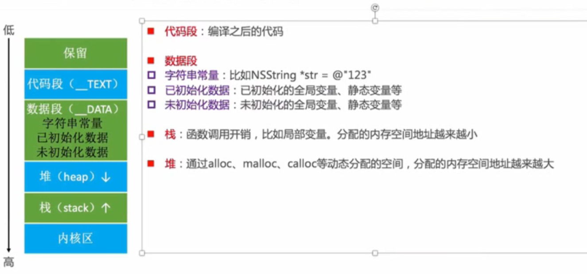

## 内存管理

### CADisplayLink。NSTimer 使用注意

 CADisplayLink，NSTimer 会对 target 产生强引用，如果 target 又对他们产生强引用，就会引发循环引用

 1. NSTimer 使用 Block
 2. 通过 Proxy 代理类来实现 target，使用timer的类对timer强引用，timer 对代理类强应用，代理类对使用 timer 的类弱引用，这样就不会有循环引用的问题，可以将 invalidate 写在 dealloc 中

NSFoundation 中提供了一个交做 NSProxy 的基类，专门用来实现代理类，继承自 NSProxy 的代理类，在调用方法的时候会跳过消息解析阶段，直接进入消息转发，而如果通过继承 NSObject 实现代理类，会走一遍完整的消息发送过程

```Objective-C
// proxy with object start
@interface ProxyObj : NSObject
@property(weak, nonatomic) id target;

+(instancetype)proxyWithObj:(id)obj;
@end

@implementation ProxyObj
+(instancetype)proxyWithObj:(id)obj{
    ProxyObj *proxy = [[ProxyObj alloc] init];
    proxy.target = obj;
    return proxy;
}
-(id)forwardingTargetForSelector:(SEL)aSelector{
    return self.target;
}
@end

// proxy with object end

// proxy with NSProxy start

@interface ProxyWithNSProxy : NSProxy
@property(weak, nonatomic) id target;

+(instancetype)proxyWithTarget:(id) target;
@end

@interface CADisplayLinkDemo()
@property(strong, nonatomic) CADisplayLink *link;
@property(strong, nonatomic) NSTimer *timer;
@end

@implementation ProxyWithNSProxy
+(instancetype)proxyWithTarget:(id) target{
    ProxyWithNSProxy *proxy = [ProxyWithNSProxy alloc];
    proxy.target = target;
    return proxy;
}
// 因为 NSProxy 在进行方法调用时会跳过 msgSend 阶段，直接进入消息转发，所以直接实现下面两个方法即可
// 效率要比 NSObject 更高
- (NSMethodSignature *)methodSignatureForSelector:(SEL)sel {
    return [self.target methodSignatureForSelector:sel];
}

-(void)forwardInvocation:(NSInvocation *)invocation {
    [invocation invokeWithTarget:self.target];
}
@end
// proxy with NSProxy end

@implementation CADisplayLinkDemo
- (void)viewDidLoad{
    [super viewDidLoad];
    self.view.backgroundColor = UIColor.whiteColor;
    // 直接使用 target 会产生循环引用，如果不手动停掉那么无法调用 dealloc，也就无法在 dealloc 中停掉，如果用 Proxy 类的话
    // Proxy 对于 self  是弱引用，计时器对 proxy 产生强引用，这是不会有循环引用，可以将停止计时器的方法写在 dealloc 中
    self.link = [CADisplayLink displayLinkWithTarget:[ProxyObj proxyWithObj:self] selector:@selector(testDisplayLink)];
    [self.link addToRunLoop:[NSRunLoop currentRunLoop] forMode:NSDefaultRunLoopMode];
    self.timer = [NSTimer scheduledTimerWithTimeInterval:1 target:[ProxyObj proxyWithObj:self] selector:@selector(testTimer) userInfo:nil repeats:YES];
}

-(void) testDisplayLink{
    NSLog(@"test display link");
}

-(void) testTimer{
    NSLog(@"test timer");
}

- (void)dealloc {
    [self.link invalidate];
    [self.timer invalidate];
    NSLog(@"viewcontroller delloc");
}
@end
```

| 代理继承自 | 方法调用过程 | 其他 |
| --- | --- | --- |
| NSObject | 完整的方法调用过程 | 对于正常的 NSObject 中实现的方法，可以正常执行，不需要转发 |
| NSProxy | 直接进入方法转发 | 所有方法都会转发，相当于直接使用被代理类自己去调用方法 |


### GCD 定时器

NSTimer 依赖于 RunLoop，如果 RunLoop 任务过于繁重，那么也可能导致 NSTimer 不准时

使用 GCD 的定时器会更加准时，不依赖 RunLoop，不会受 runloop mode 切换影响

### iOS 内存布局 




### Tagged Pointer

- 从 64bit 开始，iOS 引入了 Tagged Pointer 技术，用来存储 NSNumber、NSDate、NSString 等小对象的存储
- 在没有使用 Tagged Pointer 之前，NSNumber 等对象需要动态分配内存、维护引用计数等，NSNumber 指针存储的是堆中 NSNumber 对象的地址值
- 使用 Tagged Pointer 之后，NSNumber指针存储的数据变为为 tag+data，也就是将数据直接存储在了指针中
- 当对象指针的最低有效位是1(在 ARM，及iOS 13 之后，最高位是1)，则该指针为 Tagged Pointer
- 当指针不够存储数据时，才会使用动态分配内存的方式来存储数据
- objc_msgSend 能识别 Tagged Pointer，比如 NSNumber 的 intValue 方法，直接从指针提取数据，节省了以前调用的开销

```Objective-C
dispatch_queue_t queue = dispatch_get_global_queue(0,0);
for(int i = 0; i < 1000; i++){
    dispatch_async(queue, ^{
        //大字符串，为对象，给属性赋值时底层需要 retain release，而多线程下，非线程安全的属性去做对象类型的属性赋值时，可能会对属性原来的值多次release，就会崩溃，加锁可以解决
        self.name = [NSString stringwithFormat:@"abcdefghijk"];
    });
}

for(int i = 0; i < 1000; i++){
    dispatch_async(queue, ^{
        // 小字符串对象，指针中存储的是 Tagged Pointer，对象属性赋值的时候直接就是指针存储的 Tagged Pointer 的赋值，不需要 retain release 操作，不会崩溃
        self.name = [NSString stringwithFormat:@"abc"];
    });
}
```

### OC 对象内存管理

#### MRC

引用 retain 用完 release

早期需要使用 @synthesize <#property#> 的方式告诉编译器生成 getter/setter

之后
属性关键字 retain, assign, copy，编译器会自动生成下划线开头的成员变量，getter/setter 的方法声明及实现

类方法初始化，内部基本都已经实现了 autorelease，不需要手动去 release 一遍
```Objective-C
// 下面这三种写法在 MRC 下是相同的效果
NSMutableArray *dic = [[NSMutableArray alloc] init];
[dic release];

NSMutableArray *dic = [[[NSMutableArray alloc] init] autorelease];

NSMutableArray *dic = [NSMutableArray array];
```

#### copy

产生一个副本对象，使得副本与源对象互不影响

iOS 中（NSString，NSArray，NSDictionary等） 提供了2个拷贝方法
copy 不可变拷贝，产生不可变副本 返回 NS***
mutableCopy 可变拷贝，产生可变副本 返回 NSMutable***

由于 copy 产生了一个新的副本，所以在 MRC 环境下也需要对 copy 出来的对象进行 release 或者使用 autorelease

不可变对象 copy 出来的对象由于都是不可变对象，所以不需要新创建一个副本，直接返回不可变对象，mutableCopy 出来的为可变对象就会重新创建一个新的副本

深拷贝和浅拷贝
1. 深拷贝，内容拷贝，产生新对象
2. 浅拷贝，指针拷贝，不产生新对象，计数器 +1

不可变->不可变，浅拷贝，其他深拷贝

属性用 copy 关键字修饰，那么在 set 的时候会执行 copy 操作，生成不可变对象，所以 copy 修饰的属性不可以用可变类型

字符串一般使用 copy 修饰，数组或字典之类的一般用 strong 修饰


遵守 NSCopying 协议，并实现 copyWithZone 对象就可以实现 copy 一个新的副本

### 引用计数存储

在 64bit 中，引用计数可以直接存储在优化过的 isa 指针中，也可能存储在 SideTable 中

struct SideTable {
    spinlock_t slock;
    RefcountMap refcnts;
    weak_table_t weak_table;
}

refcnts 是存放着对象引用计数的散列表

### weak

weak  存在了 sidetable 中的 weak_table_t 中，被弱引用的对象被销毁之后，会从 SideTable 中的 弱引用表中找到引用该对象的变量，并将其置空

### ARC

LLVM 编译器（自动添加 release 及 retain） + Runtime (弱引用)

### autorelease 原理

```C++

struct __AtAutoreleasePool {
    // 构造函数 创建
    __AtAutoreleasePool() {
      atautoreleasepoolobj = objc_autoreleasePoolPush();
    }
    // 析构函数 销毁
    ~__AtAutoreleasePool() {
      objc_autoreleasePoolPop(atautoreleasepoolobj);
    }
    void * atautoreleasepoolobj;
};

{ 
    __AtAutoreleasePool __autoreleasepool; 
    objc_autoreleasePoolPush()
    Car *car = Car.alloc().init().autorelease();
    objc_autoreleasePoolPop()
}
```

- 自动释放池的主要底层数据结构是：__AtAutoreleasePool、AutoreleasePoolPage
- 调用了 autorelease 的对象最终都是通过 AutoreleasePoolPage 对象来管理的
- 源码分析

```C++
// 每个 AutoreleasePoolPage 对象占用 4096 字节，除了存放自己的成员变量，剩下的空间用来存储 autorelease 对象的地址
// 所有的 AutoreleasePoolPage 对象通过双向链表的形式连接在一起
struct AutoreleasePoolPageData{
    magic_t const magic;
    __unsafe_unretained id *next;
    pthread_t const thread;
    AutoreleasePoolPage * const parent;
    AutoreleasePoolPage *child;
    uint32_t const depth;
    uint32_t hiwat;
}

class AutoreleasePoolPage : private AutoreleasePoolPageData {
    // 用来获取 AutoreleasePoolPage 中存放对象的开始位置
    static inline id * begin() 

    // 用来获取 AutoreleasePoolPage 中存放对象的结束位置
    static inline id * end() 

    // 将对象地址放入 autoreleasepoolpage,如果当前page 满了的话会继续创建新的page,然后继续向新的 page 中添加
    static inline void *push() 

    // 找到 token 所在的地址，并赋值给stop,调用 popPage 然后从 next（也就是当前 pool 中下一个能存放对象的地址） 开始调用 objc_release(obj) 释放自动释放池的对象直到 token 所在的地址，也就是存储 POOL_BOUNDARY 的位置
}   static inline pop(void *token)，
```

### runloop 与 autorelease
[Apple 官方文档](https://developer.apple.com/documentation/foundation/nsautoreleasepool#//apple_ref/doc/uid/TP40003623)

iOS 在主线程 runloop 中注册了两个同 autoreleasepool 相关的 observer。

一个observer会监听 loopEntry 事件，调动 autoreleasePoolPush

另一个监听了 BeforeWaiting 和 BeforeExit 事件，调用 autoreleasePoolPop 来释放自动释放池变量
