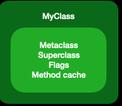
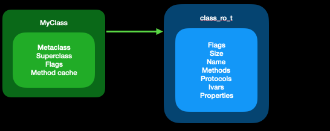
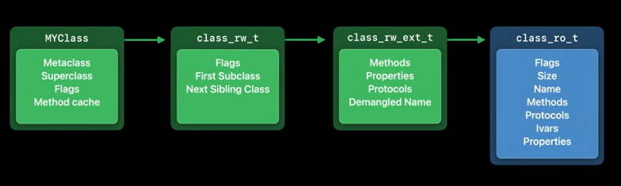
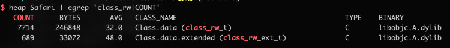
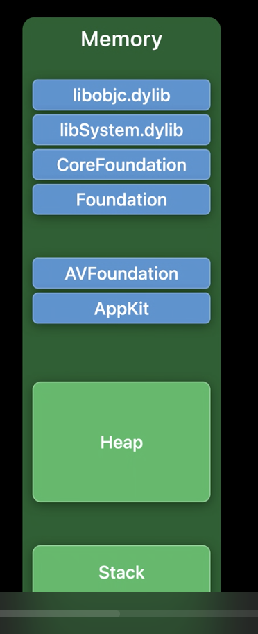
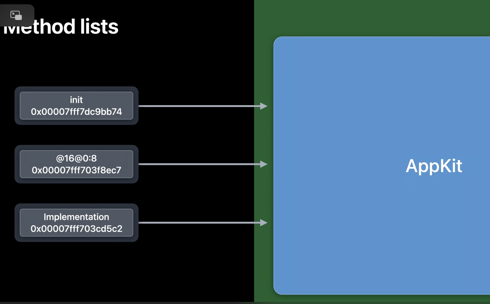
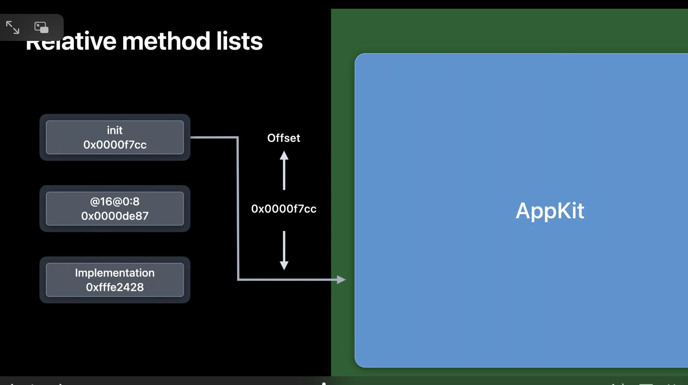

### WWDC2020 Class Data Structures Changes


[WWDC2020 视频](https://developer.apple.com/videos/play/wwdc2020/10163/) 

磁盘二进制文件中，类大概是这样的



首先，类对象本身包含了最长被访问的信息，包括指向元类、父类和方法缓存的指针.
同时还包括一个指向更多数据的指针，存储额外信息的地方叫做 `class_ro_t`



ro => read only
其中存储这包括类名、方法、协议、实例变量信息
Swift 和 Objective-C 类共享这一基础结构，所以每个 Swift 类也都有这一结构

当类第一次从磁盘加载带内存中时，开始也是这样的，但是一经使用，就会发生变化，在了解这些变化之前，我们先来了解一下 clean memory 和 dirty memory 的区别

clean memory - 指加载后不会发生更改的内存，class_ro_t 就属于 clean memory，因为它是只读的

dirty memory - 指在进程运行时会发生更改的内存。类结构一经使用就会变成 dirty memory，因为 runtime 会对其写入新的数据。例如 创建一个新的方法缓存并从类中指向它

dirty memory 要比 clean memory 使用起来代价更高一些，只要进程在运行，dirty memory 就必须一直存在。
相比之下 clean memory 可以进行移除以节省更多内存空间，因为如果需要 clean memory 系统可以再次从磁盘中加载

Mac 中使用了 swap(虚拟内存)，可以将 dirty memory 缓存到 swap 来将移除 dirty memory，但是由于 iOS 并没有使用 swap，所以 dirty memory 对于 iOS 来说，代价会更大

dirty memory 是类数据被分成两部分的原因，可以保持 clean memory 的数据越多越好，通过分离出那些永远不会改变的数据，可以把大部分类数据存储为 clean memory

这些数据足够让我们继续，但是运行时需要追踪每个类的更多信息，所以当一个类首次被使用的时候，运行时会给它分配额外的存储容量


运行时分配的存储容量就是 `class_rw_t` 用于读取/写入数据

在这个数据结构中，我们存储了只有在运行时参会生成的新信息

例如 所有的类都会连接成一个树状结构，这是通过使用 First Subclass 和 Next Sibling Class 指针实现的，通过这些可以来遍历当前使用的所有类，这对于清除方法缓存很有用

但是，为什么在 `class_rw_t` 中也会有只读数据 方法、属性？因为方法和属性可以在运行时被修改，当 category 加载时，可以向类中添加新的方法，当然，开发人员也可以通过 runtime API 向其中添加方法。由于 `class_ro_t` 是只读的，所以我们只能放在 `class_rw_t` 中来追踪这些变动。

从现在来看的话，这种操作会占用相当多的内存空间，在任何设备中都有许多类在使用。经计算，在iPhone中，大概有30M 的 `class_rw_t` 数据

如何来缩小这些结构呢？

由于运行时会对这些数据进行更改，所以我们才需要将其添加到 `class_rw_t` 结构中，但是在实际使用中，大约只有 10% 的类会真正的更改他们的方法，而且 Demangled Name 只有 Swift 类才会使用，并且 Swift 类也只有在询问它们的 Objective-C 名称时才是用到

所以，我们可以拆掉那些平时不用的部分，该操作将 `class_rw_t` 的大小减少了一半

这就出现了 `class_rw_ext_t` ，只有用到时才会初始化



对于那些确实需要额外信息的类，我们可以初始化一个 `class_rw_ext_t` 并将其放到类中以供使用

大约有 90% 的类从来不用这些扩展数据，可以再系统范围内节省大约 14MB 的内存，节省出来的这些内存可以用到更需要的地方，比如 存储 APP 数据 等

我们可以通过 heap 命令来查看 `class_rw_t` 和 `class_rw_ext_t` 两者数量的对比



对于获取类信息的方法来说，必须同时处理那些有扩展数据和没有扩展数据的类，当然 runtime 会帮你处理这些事情，从外部看，一切都没有改变，只是内存占用更少了

之所以会这样，是因为读取这些机构的代码都在运行时内，并且会同时进行更新

坚持使用 API 是很重要的，因为任何视图直接访问这些数据结构的代码，都会随着底层的数据结构变化而变得不可用

这些结构的所有信息都可以通过官方 API 获得

`class_getName`
`class_getSperclass`
`class_copyMethodList`


### WWDC2020 Relative Method List

每个类都附带一个方法列表，当你在类上编写新方法时，它就会被添加到列表中，运行时使用这些列表来解析消息发送

每个方法都包含三个信息

- SEL 方法名或者说叫选择器，选择器是字符串，但是它们具有唯一性，所以她们可以使用指针相等来进行比较
- types 接下来是方法的类型编码，用来标识参数和返回值类型的字符串，它不是用来发送消息的，但是它是运行时 introspection 和消息 forwarding 所必须的东西
- IMP 指向方法实现的指针,方法的实际代码，当你编写一个方法时，它会被编译成一个 C 函数，其中包含你的实现，方法列表中的 entry 会指向该函数

让我们来看一个具体的方法 init，它包含方法名称、类型和实现，方法列表中的每一条数据都是一个指针


Method Lists

init        0x00007fff7dc9bb74          8
@16@0:8     0x00007fff703f8ec7         +8
Impl        0x00007fff703cd5c2         +8
                                        24

在64位系统中，意味着每个方法条目占用24个字节

它属于 clean memory，但是 clean memory 并不代表不占用，它还是必须从磁盘中加载，并且使用时会占用内存



上图是一个进程中的内存方法视图，并不是按比例方法的，这是一个很大的地址空间，需要64位来寻址

在这个地址空间内，它划分成了几个部分，分别为 栈、堆、可执行文件和库或者二进制文件（蓝色部分表示的），这些都加载到了进程中

让我们方法并查看其中一个二进制文件

这里我们显示了三个方法条目，指向了二进制文件中的位置



这里我们展示了另一个代价，二进制文件可以加载到内存中的任何地方，这取决于动态链接器决定把它放在哪里

这意味着，链接器需要将指针解析到文件中，并在加载时将其修正为指向其在内存中的实际位置，这也是会耗费性能的

现在请注意，一个来自二进制文件的类方法条目，永远指向二进制文件内的方法实现，

我们不可能使一个方法的元数据存在于一个二进制文件中，而实现它的代码在另一个二进制文件中，这意味着，方法列表条目，实际上并不需要能够引用整个 64 位地址空间

他们只需要能够引用自己二进制中的函数，而且这些函数总是在附近，因此，无需使用绝对的 64 位地址，它们可以使用二进制文件中的 32 位的 relative offset

这也是今年做的一个更改



这样做有几个好处

首先，偏移量始终是相同的，不管二进制被加载到哪里的内存中，所以在它们从磁盘中加载后不需要进行修正，由于不需要进行修正，所以它们可以存储在真正的只读内存中，这样会更安全

当然 32 为的偏移，意味着我们已经将 64 位平台上所需的内存减少了一半，在一台典型 iPhone 中的系统范围内，我们测量了约 80MB 的这些方法，因为它们的尺寸减半，所以我们节省了 40MB 的内存，这样 app 就有更多的内存从而让用户体验更好

Relative Method Lists

init        0x0000f7cc          4
@16@0:8     0x0000de87         +4
Impl        0xfffe2428         +4
                                12

但是 swizzling 呢？

二进制中的方法列表现在不能引用完整的地址空间，但是如果你 swizzle 一个方法，那这个方法的实现可能在任何地方，而且，我们刚刚说过，我们希望保持这些方法列表为只读

为了处理该问题，我们提供了一个全局表，这个全局表将方法映射到它们被 swizzle 的实现上，swizzle 并不常见，实际上大多数方法从未被 swizzle 过，所以这个表最终不会变得很大

Even better, the table is compact. Memory is dirtied a page at a time. With the old style of method lists, swizzling a method would dirty the entire page it was on, resulting in many kilobytes of dirty memory for a single swizzle.
更好的是，这个表会很紧凑。使用的时候一次只会污染一个memory page。使用旧的方法列表，swizzle 一个方法会弄脏它所在的整个页面，一次 swizzle 就会产生大量千字节的 dirty memory。有了这个全局表，我们只需为一个额外的表的条目付出代价，当然你并不会看到这些变化，一切都会按以前一样工作

这些相对方法列表在新的OS 版本上是支持的 macOS Big Sur, iOS 14, tvOS 14, watchOS 7

当使用相应的最低目标进行构建时，工具会自动在二进制文件中生成 relative method lists

### Tagged Pointer Format Changes

arm64 上 tagged pointer 格式的变化

由于内存对齐，以及内存地址限制，实际内存中地址的低位及高位通常是不会被用到的，所以总为0，所以我们可以将那些一定为 0 的位将其设置为 1，这就可以让我们知道，这并不是一个真正的对象指针，然后我们可以给其他所有位赋予一些其他的意义，我们称这种指针为 tagged pointer

例如 我们可以在其他位中塞入一个数值

只要我们想教 NSNumber 如何读取这些位，并让运行时适当地处理 tagged pointer，系统的其他部分就可以把这些东西当做对象指针来处理，并且永远不会知道其中的区别

```
[NSNumber numberWithInt:42]

0000 0000 0000 0000 0000 0000 0000 0000 0000 0000 0000 0000 0000 0010 1010 0001 
```

这样可以节省我们为每一种类似情况分配一个小数字对象的代价，这是一个重大的改动

顺便说一下，这些值实际上是通过与进程启动时初始化的随机值相结合而被混淆的，这一措施使得很难伪造 tagged pointer 

接下来的讨论我们将忽略这一点，毕竟这只是在顶层所做的混淆，让你直接在内存中看这些值的时候并不是它们原有的样子

xxxx xxxx xxxx xxxx xxxx xxxx xxxx xxxx xxxx xxxx xxxx xxxx xxxx xxxx xxxx xxx1
最低位 1， 倒数第2-第4位为 Tag， 其他为 payload


这就是 Intel 上 tagged pointer 的完整格式

最低位设置为 1，表示这是一个 tagged pointer，就像我们之前所说，一个真正的指针，这个位必须始终为 0，所以这样可以区分开

接下来三位是标签位，用来表示 tagged pointer 的类型，例如 3 表示它是一个 NSNumber， 6表示 它是一个 NSData

由于我们有 3 个标签位，所以有 8 中可能的标签类型

剩下的事有效负载，这是特定类型可以随意使用的数据，对于标记的 NSNumber 这是实际的数字

现在，对于标签 7 有一个特殊的处理，它表示一个扩展标签，扩展标签使用接下来的 8 位来编码类型，这允许多出 256 个标签类型，但是代价是减少了有效负载

这使得我们可以将 tagged pointer 用于更多的类型，只要他们可以将其数据装入更小的空间，这可以用于一些东西，例如用户界面的 colors 或者 NSIndexSets

只有runtime 维护这 Apple 可以使用 tagged pointer，当然如果你是一个 Swift 程序员，也可以自己创建 tagged pointer 类型

如果你曾经使用过一个具有关联值的枚举，这就是一个类似于 tagged pointer 的类，Swift 运行时将枚举判别器储存在关联值的有效负载的备用位中

而且 Swift 对值类型的使用，实际上使得 tagged pointer 变得没有那么重要了，因为值不再需要完全是指针的大小

例如 Swift UUID 类型，可以使两个字并保持内联，而不是分配一个单独的对象，因为它不适合在一个指针里面。

这就是 Intel 的 tagged pointer

让我们来看看 ARM 的

在 ARM 上，实际是反过来的，最高位设置为 1 而不是最低位，然后接下来三位是标签号，有效负载使用剩余位

为啥要在 ARM 上使用顶部为来表示 tagged pointer 呢，实际上是对 objc_msgSend 的一个小优化

我们希望 msgSend 中最常见的路径可以尽可能的快，最常见的路径是一个普通的指针

但是有两种不常见的场景，tagged pointer  和 nil

事实证明，当我么使用最高位时，我们可以通过一次比较对着两个进行检查，相比于分开比较 tagged pointer 和 nil 这就为 msgSend 中的常见情况节省了一个条件分支

和 Intel 相同，对于标签 7 我们有一个特殊情况，接下来的 8 为被用作扩展标签，然后剩下的位用于有效负载

iOS 13之前如前面所说

但是 之后

最高位为仍然设置为 1 来保证 msgSend 的优化，然后 最低三位为标签位，如果使用扩展标签，那么它会占据最高位之后的 8 位

为啥要这样做呢，

我们来看正常的指针

我们现有的工具，比如动态链接，会忽略指针前 8 位，这是由于一个名为 Top Byte Ignore 的 ARM 特性，我们把扩展标签放在 Top Byte Ignore 位，对于一个对其指针，底部 3 个位总是 0，

我们只需要通过在指针上添加一个小数字 7，将低位设置为 1，（7 标识这是一个扩展标签），这意味着我们实际上可以将上面的这个指针，放入一个扩展标签指针的有效负载中，这个结果是 一个 tagged pointer 以及其有效负载中包含一个正常指针

为什么它会有用呢，它开启了 tagged pointer 的能力，引用二进制文件中常量数据的能力，例如字符串或其他数据结构，否则它们将不得不占用 dirty memory


