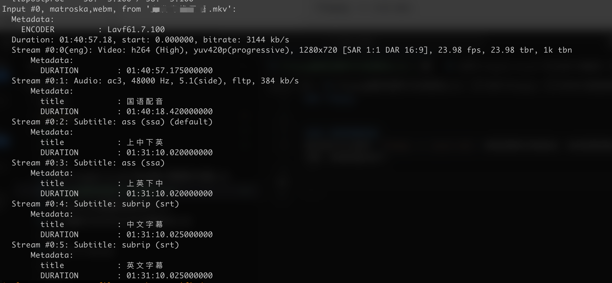

### ffmpeg

``` bash
ffmpeg -i input.mkv -map 0 -map -0:a:0 -c copy output.mkv
```

这条命令使用 ffmpeg 从 input.mkv 文件生成一个新的 output.mkv 文件，并删除了第一条音频流，以下是解析：

`-i input.mkv`
指定输入文件 input.mkv。

`-map 0`
映射输入文件中的所有流（视频、音频、字幕等）到输出。

`-map -0:a:0`
排除输入文件中的第一个音频流（0:a:0），即删除第一个音频流。
-map 的 - 前缀表示排除。

`-c copy`
对所有映射到输出文件的流使用“流拷贝”模式。这意味着不会重新编码，只复制流。这样可以提高处理速度并保持质量。

`output.mkv`
指定输出文件名。

#### 效果
生成的 output1.mkv 文件将包含 in2.mkv 的所有流，除第一个音频流外。
这对于需要调整文件中包含的流（比如删除不必要的音频轨道）非常有效，同时也避免了重新编码的时间和质量损失。

#### 注意
如果需要更改的内容多，请确保音频或视频轨道的编号正确，可以通过以下命令查看：
``` bash
ffmpeg -i input.mkv
```
这会列出文件中的所有流信息（包括编号和类型）。
